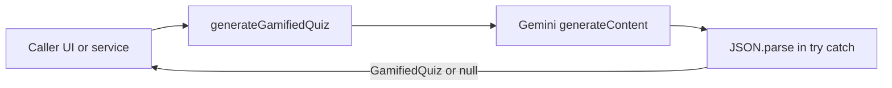

# Gamified quiz JSON prompt

## Context

- Worksheets use `[src/services/ai/aiPrompts/worksheetGeneration.ts](src/services/ai/aiPrompts/worksheetGeneration.ts)`: `genAI.getGenerativeModel({ model: GEMINI_MODEL })`, `model.generateContent(prompt)`, then `(await result.response).text()`, `JSON.parse` after `[cleanJsonResponse](src/services/ai/aiPrompts/utils.ts)` (strips accidental fences).
- Curriculum alignment is injected via `[getCurriculumPromptAlignmentBlock(curriculumType)](src/services/ai/aiPrompts/utils.ts)` with `curriculumType?: AiCurriculumPromptType` from `[src/services/ai/aiPrompts/types.ts](src/services/ai/aiPrompts/types.ts)`.
- `[src/types/domain.ts](src/types/domain.ts)` is the canonical place for cross-cutting domain types (e.g. `[Assessment](src/types/domain.ts)` already has `worksheet?: { title: string; questions: string[] }`). There is related overlap with `[PortalPracticeItem](src/services/ai/aiPrompts/types.ts)` (choices + `correctIndex`); your new names stay explicit for the gamified-quiz feature.

## 1. Types — `[src/types/domain.ts](src/types/domain.ts)`

Add (near other shared content types or after `Assessment`):

```ts
export interface QuizQuestion {
  question: string;
  options: string[];
  correctIndex: number;
  explanation: string;
}

export interface GamifiedQuiz {
  title: string;
  questions: QuizQuestion[];
}
```

No change to `Assessment` unless you later decide to persist a quiz (out of scope unless you ask for it).

## 2. New prompt module — `[src/services/ai/aiPrompts/quizGeneration.ts](src/services/ai/aiPrompts/quizGeneration.ts)`

Create a new file (keeps worksheet and quiz generators separate, as you suggested).

**Signature (align with worksheet + curriculum helpers):**

`export async function generateGamifiedQuiz(studentName: string, diagnosis: string, curriculumType?: AiCurriculumPromptType): Promise<GamifiedQuiz | null>`

**Implementation pattern:**

- Same guard as worksheet: if `!API_KEY`, `alert(...)`, return `null`.
- Build prompt string that:
  - Personalizes with `studentName` and `diagnosis`.
  - Includes `${getCurriculumPromptAlignmentBlock(curriculumType)}` when `curriculumType` is passed (same behavior as blended default when omitted).
  - **Must include verbatim** (per your spec):  
  `"You are generating a gamified practice quiz. You MUST respond with ONLY valid JSON matching this exact structure: { title: string, questions: [{ question: string, options: string[4], correctIndex: number, explanation: string }] }. Do not wrap in markdown blocks, just raw JSON."`
  - Add brief task instructions (e.g. number of questions, age-appropriate tone, Ghana context if consistent with the app) so output is usable—mirror the spirit of `[generatePracticeWorksheet](src/services/ai/aiPrompts/worksheetGeneration.ts)` without duplicating LaTeX rules unless you want math quizzes later.

**Gemini + JSON:**

- `const model = genAI.getGenerativeModel({ model: GEMINI_MODEL });`
- `const result = await model.generateContent(prompt);`
- `const text = (await result.response).text();` (same as worksheet).

**Parsing:**

- Wrap the **entire** generate + parse + validate path in **one** `try/catch`: on failure, `console.error`, optional `alert` (match worksheet UX), return `null`.
- Inside `try`, call `JSON.parse(...)` on the response string. To stay robust if the model still emits fences (worksheet path uses `[cleanJsonResponse](src/services/ai/aiPrompts/utils.ts)`), parse `JSON.parse(cleanJsonResponse(text))` — this still “parses via `JSON.parse`” and matches existing resilience. If you prefer **strict** `JSON.parse(text)` only, use that; the user requirement is satisfied either way as long as `JSON.parse` runs inside `try/catch`.

**Runtime validation (recommended, same idea as worksheet’s structure checks):**

- Assert `parsed` matches `GamifiedQuiz`: non-empty `title`, `questions` is a non-empty array.
- Each item: `question` string, `options` is `string[]` with **length 4**, `correctIndex` integer in `0..3`, `explanation` string.
- Return `parsed as GamifiedQuiz` (or a narrowed object) only if valid; otherwise `throw` to hit `catch`.

**Imports:**

- `API_KEY`, `genAI`, `GEMINI_MODEL` from `[./geminiClient](src/services/ai/aiPrompts/geminiClient.ts)`
- `AiCurriculumPromptType` from `[./types](src/services/ai/aiPrompts/types.ts)`
- `getCurriculumPromptAlignmentBlock` (and `cleanJsonResponse` if used) from `[./utils](src/services/ai/aiPrompts/utils.ts)`
- `GamifiedQuiz` from `[../../types/domain](src/types/domain.ts)` (three levels up from `aiPrompts` to `src`).

## 3. Barrel export — `[src/services/ai/aiPrompts/index.ts](src/services/ai/aiPrompts/index.ts)`

- Add: `export { generateGamifiedQuiz } from './quizGeneration';`
- Optionally add `export type { GamifiedQuiz, QuizQuestion } from '../../types/domain';` for one-stop imports from the AI barrel (nice-to-have; not required if consumers import from `types/domain`).

## 4. Verification

- Run `npm run lint` (runs `tsc --noEmit` per `[package.json](package.json)`) and fix any path or type errors.

## Architecture (high level)




## Files touched


| File                                                                                         | Action                             |
| -------------------------------------------------------------------------------------------- | ---------------------------------- |
| `[src/types/domain.ts](src/types/domain.ts)`                                                 | Add `QuizQuestion`, `GamifiedQuiz` |
| `[src/services/ai/aiPrompts/quizGeneration.ts](src/services/ai/aiPrompts/quizGeneration.ts)` | **New** — `generateGamifiedQuiz`   |
| `[src/services/ai/aiPrompts/index.ts](src/services/ai/aiPrompts/index.ts)`                   | Export `generateGamifiedQuiz`      |


No UI wiring in this plan unless you want a follow-up to call the new function from a screen and persist on `Assessment`.