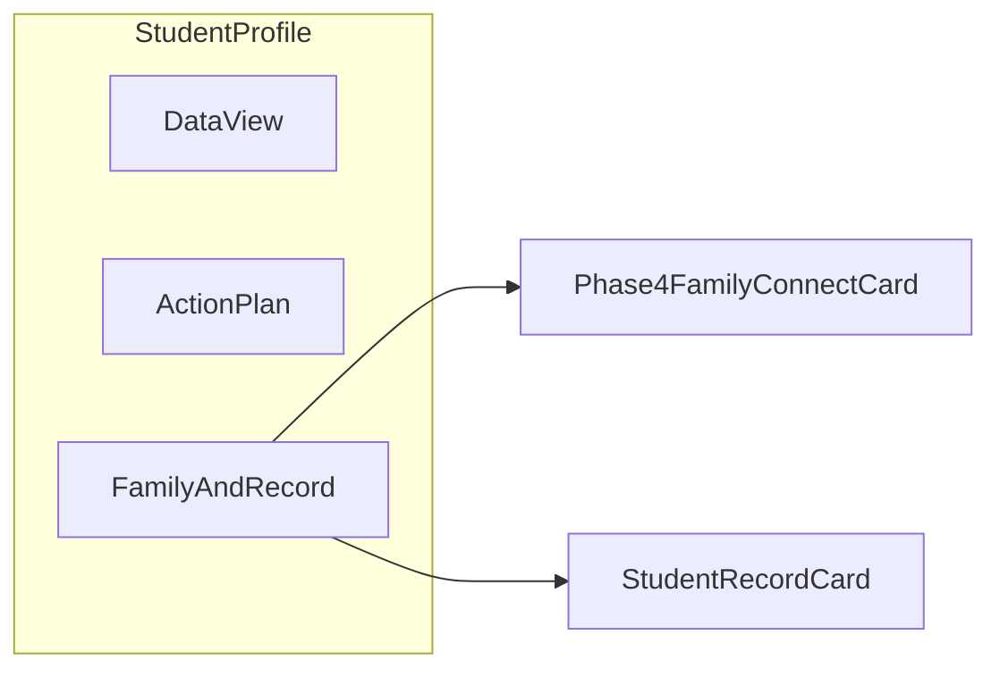

# Student profile, Phase 4 placement, and onboarding-adjacent fixes

## Current state (verified)

- [AddStudentForm.tsx](src/components/AddStudentForm.tsx) already collects cohort (`cohortId`, `grade` from cohort name, `numericGradeLevel`), `primaryLanguage`, optional SEN, `dataProcessingConsent`, and `schoolId`; [studentService.ts](src/services/studentService.ts) persists these including `dataProcessingConsent`.
- [AssessmentSetup.tsx](src/components/AssessmentSetup.tsx) already auto-enables dialect from `Student.primaryLanguage` when it matches `ASSESSMENT_DIALECT_OPTIONS` (see `useEffect` around lines 170–191).
- Phase 4 (guardian phone, WhatsApp opt-in, digest preview, portal code, `trainingDataOptIn`, `consentRecordedAt` via “record consent”) is implemented in [Phase4FamilyConnectCard.tsx](src/components/Phase4FamilyConnectCard.tsx) and rendered at the **bottom** of [StudentProfile.tsx](src/components/StudentProfile.tsx) **only when** `userRole === 'teacher'` (after the full Data / Action Plan content), which is easy to miss.

## Gaps to close

1. **Information architecture**: Phase 4 and any new “learner record” editing should sit in a **dedicated, visible area** of the profile—not only after scrolling past analytics/action plan.
2. **No UI to edit** `cohortId`, `primaryLanguage`, `officialSenStatus`, or `dataProcessingConsent` after create (only Phase 4 fields are editable today via `updateStudent`).
3. **Language list drift**: `PRIMARY_LANGUAGE_OPTIONS` in Add Student includes `English` and not `Dagbani`; `ASSESSMENT_DIALECT_OPTIONS` includes `Dagbani` and not `English`. Comments already ask to keep them in sync—centralize to avoid subtle auto-dialect bugs.
4. **Wrong signal for translanguaging on regen**: [StudentProfile.tsx](src/components/StudentProfile.tsx) `handleRegenerateLessonPlan` passes `studentInfo?.guardianLanguage` as the dialect argument to `generateSubjectRoutedLessonPlan`; learner L1 should be `**primaryLanguage`**, with sensible fallback (e.g. `guardianLanguage` only if primary missing) and **no translanguaging block for English**.
5. **Empty cohorts**: There is **no in-app cohort creation**; teachers hit a dead end. [cohortService.ts](src/services/cohortService.ts) is read-only (`getCohortsBySchool`).

## Recommended layout (best place for Phase 4)

Add a **third profile tab** next to “Data View” / “Action Plan”, e.g. **“Family & record”**, containing:

- `**Phase4FamilyConnectCard`** (unchanged behavior; optionally minor heading/copy tweaks).
- **New `StudentRecordCard` (or similar)** for editable roster fields: name (optional trim), class/cohort (`cohortId` + denormalized `grade` + `numericGradeLevel` from selected cohort), `primaryLanguage`, `officialSenStatus`, `dataProcessingConsent`—mirroring Add Student validation and calling `updateStudent` + `onUpdated` / `setStudentInfo`.

This keeps assessment-heavy views separate from **administrative / family** work and avoids duplicating Phase 4 on the add-student dialog (still appropriate to defer guardian/portal to post-enrollment).

**Role gating**: Keep Phase 4 editable for `teacher`; show `**StudentRecordCard`** for any role that can edit students today (at minimum `teacher`; consider `headmaster` if they use the same profile—align with product policy). If headmaster should manage family connect, extend the Phase 4 visibility condition from `userRole === 'teacher'` to include `headmaster` (optional; call out in implementation).

## Implementation steps

1. **Shared constants**
  - Add e.g. [src/constants/studentLanguages.ts](src/constants/studentLanguages.ts) exporting:
    - `STUDENT_PRIMARY_LANGUAGE_OPTIONS` (learner L1 list used at onboarding + record editor).
    - `ASSESSMENT_TRANSLANGUAGING_LANGUAGES` (subset used for Gemini dialect; includes languages that should turn on translanguaging—typically **exclude English**).
  - Import these from [AddStudentForm.tsx](src/components/AddStudentForm.tsx), [AssessmentSetup.tsx](src/components/AssessmentSetup.tsx) (replace local `ASSESSMENT_DIALECT_OPTIONS`), and align [Phase4FamilyConnectCard.tsx](src/components/Phase4FamilyConnectCard.tsx) `LANGUAGES` with the same source (or document why guardian list differs if intentional).
2. `**StudentRecordCard` component**
  - New file under [src/components/](src/components/): load cohorts via `getCohortsBySchool(user.schoolId)` (same pattern as Add Student), form fields listed above, submit → `updateStudent` with `name`, `cohortId`, `grade`, `numericGradeLevel`, `primaryLanguage`, `officialSenStatus`, `dataProcessingConsent`.  
  - Reuse `selectTriggerClass` / existing UI primitives for consistency.
3. `**StudentProfile` tabs**
  - Extend `viewMode` union: `'analytical' | 'action-plan' | 'family-record'` (names flexible).  
  - Render the new tab’s content: `StudentRecordCard` + `Phase4FamilyConnectCard` (remove the old bottom-only Phase 4 block).  
  - Update [FineTunePilotPanel.tsx](src/components/FineTunePilotPanel.tsx) helper text if it still says “family card” location literally at bottom.
4. **Lesson regeneration dialect**
  - In `handleRegenerateLessonPlan`, compute dialect for `generateSubjectRoutedLessonPlan` as: prefer `primaryLanguage` if it is a translanguaging language; else fallback to `guardianLanguage` under same rules; treat English / empty as `undefined` for no ESL bridge.
5. **Cohort creation (minimal)**
  - Add `createCohort` in [cohortService.ts](src/services/cohortService.ts): `addDoc` to `cohorts` with `schoolId`, `name`, `gradeLevel` (number), optional `teacherId`.  
  - Add a small dialog from [ClassRoster.tsx](src/components/ClassRoster.tsx) (e.g. “Add class”) **and/or** from empty-state messaging in [AddStudentForm.tsx](src/components/AddStudentForm.tsx) (“Create a class”) that calls `createCohort` then refreshes cohort list.  
  - Firestore security rules: confirm teachers can write `cohorts` for their `schoolId` (if rules block writes, note as a deployment follow-up).
6. **QA checklist**
  - New student → profile “Family & record” shows saved values; edits persist and `AssessmentSetup` dialect auto-select updates after changing `primaryLanguage`.  
  - Regenerate lesson uses learner L1.  
  - Empty school cohort list → user can create cohort and complete add student without console.

