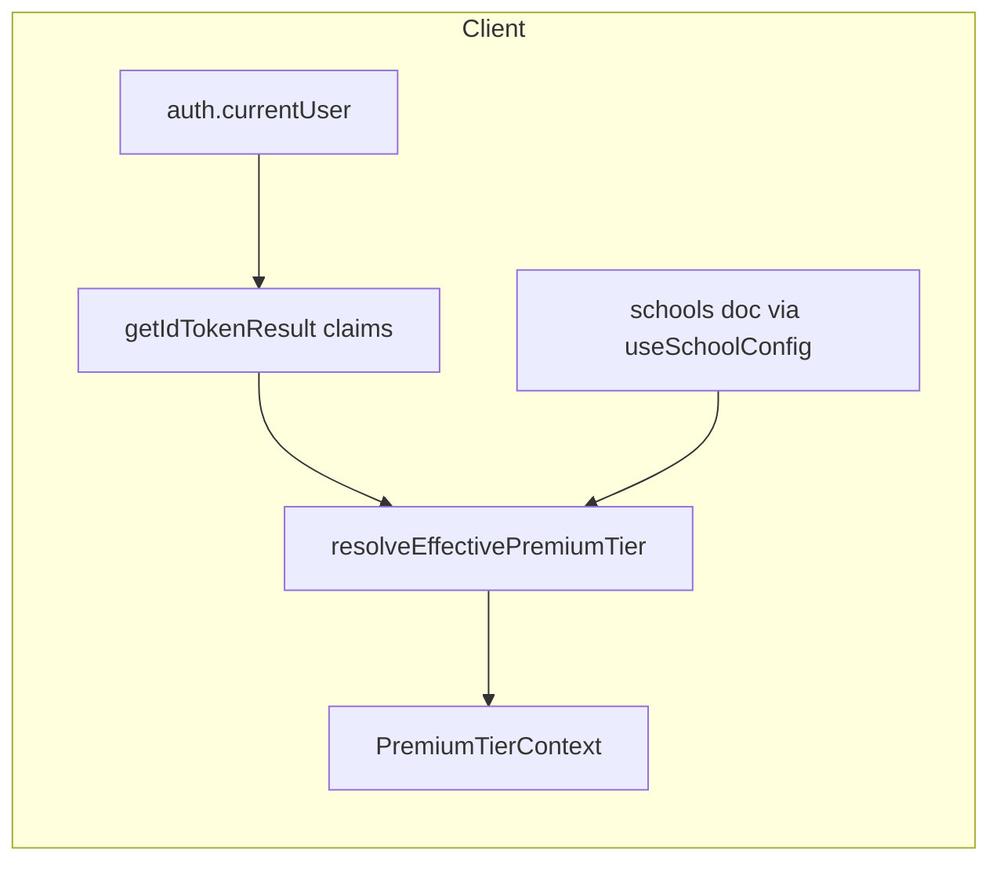

# Sprint 1.1: `isPremiumTier` context (token + curriculum binding)

## Goal (from [PREMIUM_ARCHITECTURE_PLAN.md](PREMIUM_ARCHITECTURE_PLAN.md))

Instantiate a global React context for `isPremiumTier` and **bind** it to:

1. **Authentication token** — use Firebase Auth **ID token custom claims** (cannot be forged by editing `localStorage` or Firestore from the client; only Admin SDK can set them).
2. **Tenant curriculum** — reuse existing [`School.curriculumType`](c:\Users\me\BaseCamp\src\types\domain.ts) (`'cambridge' | 'ges' | 'both'`) as loaded for the user’s `schoolId` (same path as today via [`useSchoolConfig`](c:\Users\me\BaseCamp\src\hooks\useSchoolConfig.ts)).

**Effective rule (to implement in one pure helper):** e.g. `isPremiumTier = tokenSaysPremium && schoolAllowsPremiumCurriculum` where `schoolAllowsPremiumCurriculum` is true when `curriculumType` is `'cambridge'` or `'both'`, and false when `'ges'`, missing, or school doc missing. (Adjust only if you explicitly want `both` or private-only rules to differ; the plan assumes Cambridge-aligned schools can use the premium tier.)

**Out of scope for this sprint (per roadmap):** RTDB, offline queue bypass, PWA / design system — only context + secure derivation + wiring.

---

## 1. Pure policy + claim typing

**Create** [`src/utils/resolveEffectivePremiumTier.ts`](src/utils/resolveEffectivePremiumTier.ts) (name can match repo style: short and descriptive):

- Export a function such as `resolveEffectivePremiumTier(options: { premiumClaim: boolean; curriculumType: School['curriculumType'] }): boolean` (or return `{ isPremiumTier, reason }` if you want debuggability without logging PII in production).
- Centralize the curriculum gate here so Pillar/Phase 2 code does not re-duplicate conditions.

**Create** [`src/types/authClaims.ts`](src/types/authClaims.ts) (or similar):

- Declare the custom-claim key (e.g. `premiumTier: boolean` on `idTokenResult.claims`) and a small helper `readPremiumTierClaim(claims: object | undefined): boolean` to avoid scattered string literals.

**Optional:** extend Firebase’s `IdTokenResult` via **module augmentation** in [`src/vite-env.d.ts`](c:\Users\me\BaseCamp\src\vite-env.d.ts) *or* colocate a `basecamp-auth.d.ts` so `claims.premiumTier` is typed when reading the token.

---

## 2. `PremiumTierProvider` + hook

**Create** [`src/context/PremiumTierContext.tsx`](src/context/PremiumTierContext.tsx):

- **Inputs:** `user: UserData` (from [`Header.UserData`](c:\Users\me\BaseCamp\src\components\layout\Header.tsx)), `children`.
- **Data:** call existing [`useSchoolConfig(user.schoolId)`](c:\Users\me\BaseCamp\src\hooks\useSchoolConfig.ts) for `school?.curriculumType`.
- **Token:** on `user.id` (and when auth state changes), use `onAuthStateChanged` from `firebase/auth` with [`auth`](c:\Users\me\BaseCamp\src\lib\firebase.ts) and `await currentUser.getIdTokenResult(true)` to read claims (the `true` forces refresh when you deploy claim changes; use judiciously to avoid extra network churn — acceptable for login + explicit refresh later).
- **State exposed:** at minimum `isPremiumTier: boolean`, `isReady: boolean` (or `status: 'loading' | 'ready'`), and optionally `curriculumType` / raw claim for diagnostics-only UI.
- **Edge cases:** if `!user.schoolId` (district / super admin without a school), treat as **not** premium for this sprint (unless product says otherwise). If school is still loading, keep `isReady` false or keep `isPremiumTier` false until both token + school are resolved — pick one policy and document it in the file comment.

- **Export** `usePremiumTier()` with the same “must be inside provider” pattern as [`useAuth`](c:\Users\me\BaseCamp\src\context\AuthContext.tsx).

**Do not** read premium from `localStorage`, query params, or a plain env flag in production; any **diagnostics-only** dev override (e.g. gated by [`isDemoHostedBuild`](c:\Users\me\BaseCamp\src\config\demoMode.ts)) can live in the resolver and must default off.

---

## 3. Wire the provider in the app shell

**Modify** [`src/App.tsx`](c:\Users\me\BaseCamp\src\App.tsx) inside `LoggedInApp`:

- Import `PremiumTierProvider`.
- Wrap the existing `LoggedInApp` JSX so that `LoggedInAppChrome` (and any sibling content under the same user session) is wrapped:  
  `PremiumTierProvider user={user}` → existing `AssessmentProvider` → `LoggedInAppChrome` …
- Rationale: `LoggedInApp` already owns the canonical `user` object and the offline/sync plumbing; the provider should sit here rather than in [`main.tsx`](c:\Users\me\BaseCamp\src\main.tsx) (portal route [`StudentPortalApp`](c:\Users\me\BaseCamp\src\features\students\StudentPortalApp.tsx) is a separate entry — **no change** in 1.1 unless you need premium in the student portal immediately).

**Modify** [`src/components/layout/LoggedInAppChrome.tsx`](c:\Users\me\BaseCamp\src\components\layout\LoggedInAppChrome.tsx) only if you add a one-line dev-only affordance (e.g. a banner when `isPremiumTier` in diagnostics); otherwise **no change** required for the feature to work — consumers will import `usePremiumTier` from feature code in later sprints.

---

## 4. Server-side: custom claims (required for real security)

Reading claims on the client is useless if nothing sets them. **Sprint 1.1 should include a minimal, deployable way** to set `premiumTier` on the user record in Firebase Auth:

**Modify** [`functions/src/index.ts`](c:\Users\me\BaseCamp\functions\src\index.ts) (v2 `onCall` like existing `createSchoolTeacher`):

- Add a callable, e.g. `syncPremiumTierForUser` or `adminSetPremiumClaim`, that:
  - Verifies the caller (recommend: **`role === 'super_admin'`** via Firestore `users/{uid}` to match your existing patterns, same as other admin-gated function logic).
  - Accepts a target `uid` and a boolean, **or** derives the value from `schools/{schoolId}` if you add a field like `isPremiumTenant` later (optional for 1.1; simplest is bool argument + audit log).
  - Uses `getAuth().setCustomUserClaims(uid, { ...existingClaims, premiumTier: true|false })` (merge with existing claims as required by [Firebase’s custom-claims contract](https://firebase.google.com/docs/auth/admin/custom-claims) — you must read-modify-set if you add more claims over time).
- **Export** the function in the same file so it deploys with the existing Functions bundle.

**Do not** expose an unauthenticated or teacher-callable endpoint that sets premium claims.

**Optional (nice):** a tiny **admin-only** script under [`scripts/`](c:\Users\me\BaseCamp\scripts) using Admin SDK for one-off bootstrapping (same claim key), to avoid using the console for every user during development.

**Firestore rules:** No change strictly required for 1.1 if premium UI is client-only; **future** Pillar work must enforce premium operations in rules using `request.auth.token.premiumTier` — note that in comments near the new callable.

---

## 5. Data model (optional, small)

**Optionally modify** [`src/types/domain.ts`](c:\Users\me\BaseCamp\src\types\domain.ts) and admin tooling to add a Firestore field such as `isPremiumTenant?: boolean` on `School` **only** if you want the callable to *source* entitlement from the school document instead of a raw bool argument. The **context still must** re-check `curriculumType` on the client for the “tenant flag” part of the architecture; the custom claim is what stops arbitrary UI toggling.

---

## 6. Verification checklist (after implementation)

- Logged-in user with **no** `premiumTier` claim → `isPremiumTier === false` for Cambridge school (or false everywhere until claim is set, depending on policy).
- Same user after Admin sets `premiumTier: true` and token refresh → `isPremiumTier === true` for Cambridge / both; **remains false** for GES-only school.
- `usePremiumTier` throws or returns a safe default if used outside provider (match `useAuth` behavior).

---

## File summary

| Action | File |
|--------|------|
| Create | `src/utils/resolveEffectivePremiumTier.ts` |
| Create | `src/types/authClaims.ts` (or merge into an existing `types` module if you prefer fewer files) |
| Create | `src/context/PremiumTierContext.tsx` |
| Modify | `src/App.tsx` (wrap `LoggedInApp` tree with `PremiumTierProvider`) |
| Modify | `src/vite-env.d.ts` or new `src/types/basecamp-auth.d.ts` (optional claim typing) |
| Modify | `functions/src/index.ts` (callable to set/merge `premiumTier` custom claim) |
| Optional | `src/types/domain.ts` (`School` admin field) |
| Optional | `scripts/…` (Admin SDK bootstrap) |

No changes to [`.cursor/rules/firestore-deploy-targets.mdc`](c:\Users\me\BaseCamp\.cursor\rules\firestore-deploy-targets.mdc) or rule files **unless** you add Firestore-stored fields that need new write rules.
