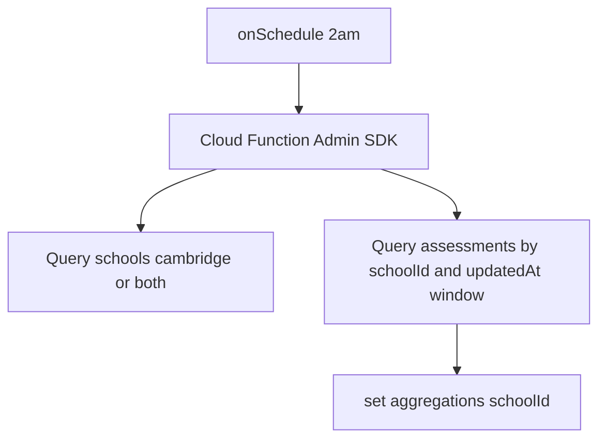

# Sprint 1.2: Executive Data Warehouse (scheduled aggregation)

**Scope note:** The phased roadmap labels this as **Sprint 1.2** ([PREMIUM_ARCHITECTURE_PLAN.md](PREMIUM_ARCHITECTURE_PLAN.md) — Executive nightly aggregation). Sprint 1.1 (premium context) is already implemented.

## Product goal

- Run **server-side** on a **schedule** (off-peak, e.g. 2:00 AM local) via **Firebase scheduled functions** (implemented with **Cloud Scheduler + Pub/Sub** under the hood, using `onSchedule` from `firebase-functions/v2/scheduler`).
- **Input:** `assessments` touched in a **rolling 24h window** (per architecture: `updatedAt` / write time; align with what is reliably set on every write in [src/services/assessmentService.ts](c:\Users\me\BaseCamp\src\services\assessmentService.ts)).
- **Output:** **Denormalized summary** so a headmaster UI can do **one document read** instead of wide client reads. Metrics called out in the plan: **averages, cohort-relevant rollups, “percentage changes in mastery”** (see **MVP vs stretch** below).

## Multi-tenant document shape (important)

The report text says a **single** document id `cambridge_executive_summary` under `aggregations/`. A **literal singleton** that stores **all** schools would allow any permitted reader to see every school’s numbers unless the rules are extremely custom.

**Recommended implementation (secure, still O(1) per user):**

- Collection: `aggregations`
- **Document id = `schoolId`**
- **Required field** e.g. `summaryKind: 'cambridge_executive_summary'` (and `schemaVersion`, `windowStart`, `windowEnd`, `generatedAt` server timestamp) so the doc is unambiguous and evolvable.

Each headmaster reads **only** `aggregations/{theirSchoolId}` (one read). The architecture’s “one document per dashboard” goal is satisfied without cross-tenant leakage.

If you **must** match a **single** global doc id (pilot / single school only), treat that as a **separate, explicit** product decision; the plan above should be the default for BaseCamp’s multi-tenant `schools` model.

## Aggregation logic (align with existing client analytics)

The current [HeadmasterDashboard](c:\Users\me\BaseCamp\src\features\dashboards\HeadmasterDashboard.tsx) uses [generateSchoolAnalytics](c:\Users\me\BaseCamp\src\services\analytics\schoolAnalyticsService.ts) (overview + per-classroom metrics, scores, SEN flags, top learning gap). For Sprint 1.2 **backend parity (MVP)**:

- For each **eligible school** (see gating), load **assessments** in `[windowStart, windowEnd]` using **school-scoped** queries (`schoolId` + `updatedAt` range, or equivalent).
- Reuse the **same scoring idea** as the client: `effectiveNumericScore` from [src/utils/analyticsUtils.ts](c:\Users\me\BaseCamp\src\utils\analyticsUtils.ts) (or duplicate the small formula in the functions package to avoid importing the Vite app — prefer **copy the minimal numeric helper** or a **tiny shared** module if you introduce a `packages/shared` or `functions/src/lib/analyticsUtils.ts`).

**Stretch (percent change in mastery / gaps):** Persist the **previous run’s** summary inside the same doc (or a sibling `aggregations/{schoolId}_meta`) and compute day-over-day deltas. **MVP** can write only **current window** stats and set `deltas: null` or omit until the second run.

**Gating to Cambridge / premium tier:** The warehouse narrative targets **private Cambridge** schools. Constrain to schools where `curriculumType` is `'cambridge'` or `'both'` in [src/types/domain.ts](c:\Users\me\BaseCamp\src\types\domain.ts) (read via Admin `schools` queries). Optional: add `schoolType === 'private'` if product wants to exclude public GES from this pipeline.

## Files to create

| File | Purpose |
|------|--------|
| [functions/src/aggregateCambridgeExecutive.ts](c:\Users\me\BaseCamp\functions\src\aggregateCambridgeExecutive.ts) (or similar) | `run` function: time window, list schools, per-school assessment query, compute metrics, `set`/`merge` into `aggregations` |
| [functions/src/lib/effectiveNumericScore.ts](c:\Users\me\BaseCamp\functions\src\lib\effectiveNumericScore.ts) (optional) | Duplicated or extracted score helper matching client rules |

## Files to modify

| File | Purpose |
|------|--------|
| [functions/src/index.ts](c:\Users\me\BaseCamp\functions\src\index.ts) | Export new **`onSchedule`** function (e.g. `aggregateCambridgeExecutiveSummary`), `REGION` and **schedule** (cron + **timeZone** e.g. `Africa/Accra` or `Europe/London` per ops), **memory/timeout** if many schools (start conservative, e.g. 256MB–1GB, 5–9 min) |
| [firestore.rules](c:\Users\me\BaseCamp\firestore.rules) | New `match /aggregations/{summaryId} { allow read: ... }` so **headteacher** reads `summaryId == getUserSchoolId()`, **district** scope as needed, **super_admin** all; **no client writes** (Admin only) |
| [firestore.indexes.json](c:\Users\me\BaseCamp\firestore.indexes.json) | If Admin queries use composite filters, add index e.g. **`assessments`: `schoolId` ASC, `updatedAt` ASC** (or DESC per query direction). The repo already has `schoolId` + `cohortId` + `updatedAt` ([firestore.indexes.json](c:\Users\me\BaseCamp\firestore.indexes.json)) — a **dedicated** `schoolId` + `updatedAt` index may still be required for a query that **does not** filter on `cohortId`. |
| [firestore.rules.demo](c:\Users\me\BaseCamp\firestore.rules.demo) (if present) | Mirror `aggregations` rules for diagnostics so local/demo builds do not break |

## Deployment and ops (no new repo file required unless you want runbooks)

- Deploy functions: project scripts already include `npm run deploy:functions` (see [package.json](c:\Users\me\BaseCamp\package.json)); ensure **Cloud Scheduler** and **Pub/Sub** APIs are enabled for the Firebase project.
- First deploy of `onSchedule` creates the schedule job; verify in **Google Cloud Console** (Scheduler) that the job exists and the timezone matches intent.

## Out of scope for 1.2 (per roadmap / separation)

- **No** `HeadmasterDashboard` swap to the new doc (unless you explicitly expand scope) — the sprint deliverable is **pipeline + write path + rules + indexes**; UI subscription can be a small follow-up for “one read” in the app.
- **Sprint 1.3** parent digests and Gemini remain separate.
- **RTDB / offline queue** — not part of Phase 1 warehouse.

## Verification checklist (after implementation)

- Function runs in emulator or staging without permission errors; **Admin** writes `aggregations/{schoolId}`.
- A **headteacher** can **read** only their `aggregations/{schoolId}`; a **peer school** user cannot.
- `assessments` queries for the 24h window do not throw “missing index” in logs.
- Re-run: second execution overwrites/merges summary with fresh `window*` metadata.
