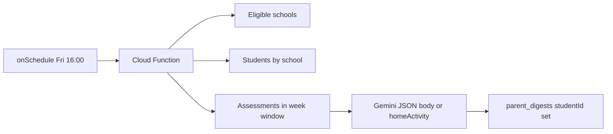

# Sprint 1.3: Premium Parent weekly digest (scheduled + Gemini + `parent_digests`)

**Source of truth in the architecture ([PREMIUM_ARCHITECTURE_PLAN.md](PREMIUM_ARCHITECTURE_PLAN.md)):** a **scheduled Cloud Function** (Friday **4:00 PM**), **Gemini** natural language output, results **only** in **`/parent_digests`**, reusing the existing prompt flow around **`generateWeeklyParentDigestEnglish`** ([`src/services/ai/aiPrompts/phase4Ecosystem.ts`](c:\Users\me\BaseCamp\src\services\ai\aiPrompts\phase4Ecosystem.ts), also used by [`src/services/parentDigestService.ts`](c:\Users\me\BaseCamp\src\services\parentDigestService.ts)).

**Explicitly out of scope for 1.3 (same pattern as 1.2 / plan):** wiring a **Parent Login** React screen to subscribe to `parent_digests` (can be a fast follow). This sprint delivers the **server pipeline + secure storage + rules**.

---

## 1. Behavioral spec (decisions to lock in code)

| Topic | Recommendation |
|--------|------------------|
| **Schedule** | `onSchedule` from [`firebase-functions/v2/scheduler`](https://firebase.google.com/docs/functions/schedule-functions): e.g. cron `0 16 * * 5` with **`timeZone: 'Africa/Accra'`** (confirm Friday = day 5 in Firebase cron; adjust if your Firebase cron variant uses 0 = Monday). |
| **Who is in scope** | Same **school gating** as Sprint 1.2 warehouse: `schools` where `curriculumType` in **`['cambridge','both']`** (optional later: add `schoolType == 'private'`). |
| **Week window** | Define a single window in code (document in file comment), e.g. **Monday 00:00 → Friday 16:00** in the schedule timezone, or **rolling last 7 days** ending at run time. Use **`assessment.timestamp`** (not only `updatedAt`) so the digest reflects **academic activity in the period**; align with client history ordering used in [`assessmentHistoryToBriefJson`](c:\Users\me\BaseCamp\src\services\ai\aiPrompts\phase4Ecosystem.ts). |
| **Skip / empty** | Skip Gemini if **no assessments** in the window (mirror `if (!history.length) return null` in the client). Optionally skip students without `guardianPhone` if product wants fewer writes. |
| **Output contract** | Preserve the **strict JSON** shape: `body`, `homeActivity` (same parsing as client). **MVP:** English only in `parent_digests`. **Stretch:** second Gemini call porting **`translateParentDigest`** ([`phase4Ecosystem.ts`](c:\Users\me\BaseCamp\src\services\ai\aiPrompts\phase4Ecosystem.ts)) into the function using `Student.guardianLanguage` + optional `localizedBody` field. |
| **Idempotency** | Upsert `parent_digests/{studentId}` with `weekKey` or `windowEndMs` so re-runs are clearly versioned. |

---

## 2. Gemini + secrets in Cloud Functions

- **Add dependency:** `@google/generative-ai` to [`functions/package.json`](c:\Users\me\BaseCamp\functions\package.json) (client uses [`GoogleGenerativeAI`](c:\Users\me\BaseCamp\src\services\ai\aiPrompts\geminiClient.ts); **do not** read `VITE_*` in functions).
- **API key:** Use **Firebase Functions params / Secret** (e.g. `defineSecret('GEMINI_API_KEY')` or `defineString`) and pass the secret into the scheduled function options per [v2 secrets docs](https://firebase.google.com/docs/functions/config-env). Document that the value must match the key used for pilot/diagnostics as appropriate.
- **Model:** Match client default [`GEMINI_MODEL`](c:\Users\me\BaseCamp\src\services\ai\aiPrompts\geminiClient.ts) or override via env string for operations.

**Port prompt logic (no import from Vite app):** create a small server-side module that mirrors the **same strings and JSON extraction** as `generateWeeklyParentDigestEnglish`:

- `assessmentHistoryToBriefJson` (copy/adapt)
- `getCurriculumPromptAlignmentBlock` (the three branches from [`getCurriculumPromptAlignmentBlock`](c:\Users\me\BaseCamp\src\services\ai\aiPrompts\utils.ts) only — do not pull the whole RAG utils file)
- `cleanJsonResponse` (copy from [`cleanJsonResponse`](c:\Users\me\BaseCamp\src\services\ai\aiPrompts\utils.ts))
- `resolveAiCurriculumPromptType`-style mapping from the school’s `curriculumType` to the same alignment block the client would use

This keeps the **“bind … to the Gemini API”** contract stable without bundling the entire frontend tree.

---

## 3. Data loading (Admin SDK)

- **Schools:** `schools` query with `curriculumType` `in` `['cambridge','both']` (same as [`aggregateCambridgeExecutive.ts`](c:\Users\me\BaseCamp\functions\src\aggregateCambridgeExecutive.ts)).
- **Students per school:** `students` where `schoolId == …` and optionally `enrollmentStatus == 'active'` if present in [`src/types/domain.ts`](c:\Users\me\BaseCamp\src\types\domain.ts).
- **Assessments per student:** `assessments` where `studentId == …` and **`timestamp` in range**, `orderBy('timestamp', 'desc')` — existing index **studentId + timestamp** is already in [`firestore.indexes.json`](c:\Users\me\BaseCamp\firestore.indexes.json) (add **studentId + timestamp + range** only if a new query shape is required; typically the existing pair is enough when inequality is on `timestamp` only).

**Throughput:** many students ⇒ many Gemini calls. Implement **concurrency cap** (small pool) + basic **retry** on 429/5xx; log per-student failures without failing the whole run.

---

## 4. Firestore: `parent_digests` document shape and rules

- **Path:** `parent_digests/{studentId}` (one doc per student = **O(1)** for a future parent client scoped to that id).
- **Fields (suggested):** `digestKind: 'weekly_parent'`, `schemaVersion`, `schoolId`, `studentName` (first name or display), `body`, `homeActivity`, `windowStartMs`, `windowEndMs`, `generatedAt` (server timestamp), optional `localizedBody` if translation is in scope.
- **Rules (new `match` before the catch-all):**
  - **Writes:** `allow write: if false` (only **Admin SDK** from the function).
  - **Reads:** Until a dedicated **parent auth** model exists, choose one: **(A)** `allow read: if isAdmin() || (isHeadteacher() && child student’s school == headteacher’s school)` for QA, **(B)** `request.auth.token.parentStudentId == studentId` (custom claim) placeholder, and/or **(C)** `allow read: if false` and tighten later. Document the chosen policy in a comment in [`firestore.rules`](c:\Users\me\BaseCamp\firestore.rules).

Mirror the same block in [`firestore.rules.demo`](c:\Users\me\BaseCamp\firestore.rules.demo) (include demo super-admin read if you use `isDemoSeedSuperAdminAuth()` like other matches).

---

## 5. Wire-up in `functions` entrypoint

- [`functions/src/index.ts`](c:\Users\me\BaseCamp\functions\src\index.ts): export a new **`onSchedule`** (e.g. `weeklyParentDigestJob`) with **region** consistent with existing functions (e.g. `europe-west1`), **memory/timeout** suitable for N Gemini calls (start **512MiB–1GiB**, **9–30 min** max depending on expected volume; tune after first run).
- Implementation body: `import` and call a runner from a dedicated module (below).

---

## 6. Files to create

| File | Role |
|------|------|
| [`functions/src/weeklyParentDigest.ts`](c:\Users\me\BaseCamp\functions\src\weeklyParentDigest.ts) (name flexible) | Orchestration: time window, school/student/assessment queries, throttled Gemini + Firestore `set`/`merge` |
| [`functions/src/lib/weeklyParentDigestPrompt.ts`](c:\Users\me\BaseCamp\functions\src\lib\weeklyParentDigestPrompt.ts) | Build prompt + parse JSON; uses curriculum alignment + `cleanJsonResponse` copy |
| [`functions/src/lib/cleanJsonResponse.ts`](c:\Users\me\BaseCamp\functions\src\lib\cleanJsonResponse.ts) | Small duplicate of client [`cleanJsonResponse`](c:\Users\me\BaseCamp\src\services\ai\aiPrompts\utils.ts) (or colocate in prompt file if you prefer one file) |

---

## 7. Files to modify

| File | Change |
|------|--------|
| [`functions/package.json`](c:\Users\me\BaseCamp\functions\package.json) | Add `@google/generative-ai` |
| [`functions/src/index.ts`](c:\Users\me\BaseCamp\functions\src\index.ts) | New scheduled export + secret wiring |
| [`firestore.rules`](c:\Users\me\BaseCamp\firestore.rules) | `parent_digests` match |
| [`firestore.rules.demo`](c:\Users\me\BaseCamp\firestore.rules.demo) | Same for diagnostics |
| [`firestore.indexes.json`](c:\Users\me\BaseCamp\firestore.indexes.json) | **Only if** a new composite query is required for the weekly assessment pull |

**Optional (not required for core sprint):** a one-off script under `scripts/` to invoke the runner locally with ADC (same idea as the manual test for 1.2).

---

## 8. Deployment and ops

- `npm --prefix functions run build`
- `firebase deploy --only functions` (pilot and/or demo with `--config firebase.demo.json` as needed)
- Set **Secret / config** for `GEMINI_API_KEY` in the target project(s)
- After deploy, confirm **Cloud Scheduler** job for the new function in GCP Console
- **Do not** use [`deploy:diagnostics`](c:\Users\me\BaseCamp\package.json) for pilot-only secrets without checking project alignment ([firestore-deploy-targets](c:\Users\me\BaseCamp\.cursor\rules\firestore-deploy-targets.mdc))

---

## 9. Verification

- At least one test student with assessments in the window produces a non-empty `parent_digests/{studentId}` doc
- Firestore **rules** deny arbitrary client **writes**; **reads** match the policy you selected
- Logs show bounded concurrency and no unbounded fan-out
