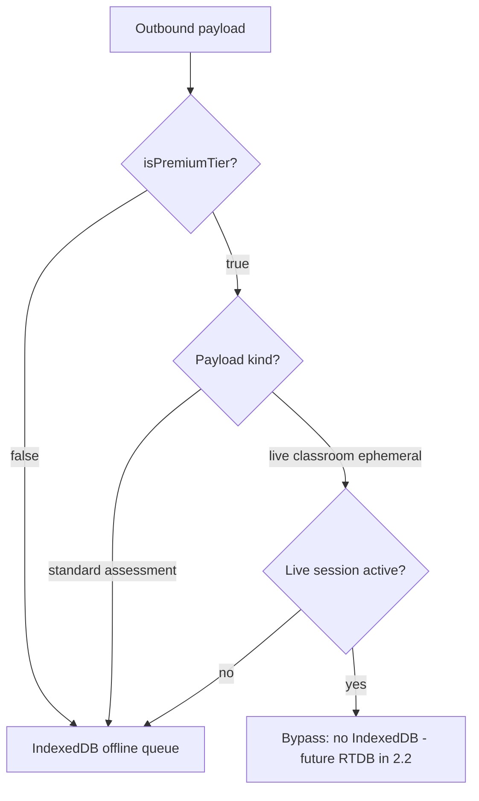

# Sprint 2.1: Offline queue bypass (IndexedDB) for Premium live sessions

## Context from the architecture doc

[PREMIUM_ARCHITECTURE_PLAN.md](c:\Users\me\BaseCamp\PREMIUM_ARCHITECTURE_PLAN.md) (lines 18–20, 236–243) requires: when `isPremiumTier` is **true**, route by **payload kind**—**permanent academic / standard assessment** → legacy IndexedDB queue; **ephemeral Live Classroom** → **do not** enqueue to IndexedDB (future: direct RTDB in Sprint 2.2).

## Audit (current codebase)

| Area | Finding |
|------|--------|
| [src/services/core/offlineQueueService.ts](c:\Users\me\BaseCamp\src\services\core\offlineQueueService.ts) | Single queue type `QueuedAssessment`; `addToQueue` / `enqueueWorksheetBatch` always write to IndexedDB. `enqueueWorksheetBatch` is **not** imported elsewhere yet—only `addToQueue` is used from app code. |
| [src/hooks/useSyncManager.ts](c:\Users\me\BaseCamp\src\hooks\useSyncManager.ts) | Drains **all** queued rows through the assessment pipeline to Firestore; no notion of premium or live session. |
| Callers of `addToQueue` | [src/hooks/useAnalysisFlow.ts](c:\Users\me\BaseCamp\src\hooks\useAnalysisFlow.ts) (hybrid offline path) and [src/context/AssessmentContext.tsx](c:\Users\me\BaseCamp\src\context\AssessmentContext.tsx) (manual/upload offline paths). All are **standard** assessment flows today. |
| Premium flag | [src/context/PremiumTierContext.tsx](c:\Users\me\BaseCamp\src\context\PremiumTierContext.tsx) exposes `isPremiumTier`; `LoggedInApp` already wraps with `PremiumTierProvider` so descendants can use `usePremiumTier()`. |
| Live session | **No** `isLiveSessionActive` (or equivalent) exists yet. Sprint 2.1 should introduce a **minimal** session flag so routing is not faked with globals. |

## Target routing (reference)

**Important:** `enqueueWorksheetBatch` and all existing `addToQueue` call sites for **worksheet / manual / hybrid** stay on the **standard** path (IndexedDB) per the doc (“permanent academic record” / standard assessment). Only **new** or explicitly tagged **live classroom ephemeral** entries use the bypass branch.

## Files to create

1. **`src/context/LiveClassroomSessionContext.tsx`** (new)  
   - Minimal React context: e.g. `isLiveSessionActive: boolean` (default `false`) and `setLiveSessionActive` (or a small `beginSession` / `endSession` API).  
   - No RTDB; values are in-memory for Sprint 2.1 so `AssessmentContext` / `useAnalysisFlow` can read the flag when deciding routing.  
   - Sprint 2.3 UI can flip this when the “Follow Me” session starts/ends.

2. **`src/services/core/offlineQueueRouting.ts`** (new, **recommended** to keep [offlineQueueService.ts](c:\Users\me\BaseCamp\src\services\core\offlineQueueService.ts) focused)  
   - Pure exports, e.g. `OfflineQueuePayloadChannel = 'standard_assessment' | 'live_classroom_ephemeral'`.  
   - `shouldEnqueueToIndexedDb(args: { isPremiumTier: boolean; isLiveSessionActive: boolean; channel: OfflineQueuePayloadChannel }): boolean` encoding the table above.  
   - Optionally `describeOfflineQueueRoute(...)` for debug logging.

3. **`src/services/core/liveClassroomQueueBypass.ts`** (new, **optional** but aligns with “dependency inversion”)  
   - A single injectable no-op (or `console.debug` in dev) **bypass handler** type, e.g. `setLiveClassroomQueueBypassHandler(fn | null)` and `dispatchLiveClassroomQueueBypassReadOnly(_: Omit<QueuedAssessment, 'id' | 'timestamp'>)` called from `addToQueue` when routing chooses bypass, so Sprint 2.2 can register RTDB without rewriting queue APIs.  
   - *Alternative (smaller diff):* implement the handler registry **inside** `offlineQueueService.ts` and skip a third file—choose based on how large `offlineQueueService` grows.

## Files to modify

1. **[src/services/core/offlineQueueService.ts](c:\Users\me\BaseCamp\src\services\core\offlineQueueService.ts)**  
   - Extend `QueuedAssessment` with an optional discriminator, e.g. `offlineQueueChannel?: 'standard' | 'live_classroom_ephemeral'` (default **`standard`** in code paths for backward compatibility) so any row accidentally present in IDB is identifiable.  
   - Change `addToQueue` to accept a **second argument** `routing: { isPremiumTier: boolean; isLiveSessionActive: boolean; channel: OfflineQueuePayloadChannel }` (or a merged options object) and:  
     - If `shouldEnqueueToIndexedDb(...)` is true → current IndexedDB `update` behavior (unchanged semantics).  
     - If false → **no** IndexedDB write; call bypass handler (no-op in 2.1) and return a structured result, e.g. `Promise<AddToQueueResult>` with `'queued' | 'bypassed'`, so callers do not show “queued for offline” UI for bypass.  
   - `enqueueWorksheetBatch`: pass **`channel: 'standard_assessment'`** (or leave default) so batch worksheets **always** enqueue—matches “permanent record” in the research doc.  
   - Re-export relevant types from `offlineQueueRouting.ts` if you split files.

2. **[src/hooks/useSyncManager.ts](c:\Users\me\BaseCamp\src\hooks\useSyncManager.ts)**  
   - At the start of processing each `QueuedAssessment`, if `item.offlineQueueChannel === 'live_classroom_ephemeral'`, **do not** run the existing pipeline: `removeFromQueue(item.id)` + `console.warn` (defensive repair for any legacy/bug state). In steady state, live items should not appear.  
   - No change to sync timing for standard rows unless you later add a product requirement to **pause** sync during live (not required by the architecture excerpt for 2.1).

3. **[src/App.tsx](c:\Users\me\BaseCamp\src\App.tsx)**  
   - Wrap `AssessmentProvider` (and thus the sync tree) with `LiveClassroomSessionProvider` **inside** `PremiumTierProvider` so hooks can use both.

4. **[src/context/AssessmentContext.tsx](c:\Users\me\BaseCamp\src\context\AssessmentContext.tsx)**  
   - Use `usePremiumTier()` and `useLiveClassroomSession()`.  
   - On offline `addToQueue` calls (manual, upload, and any path that enqueues), pass routing with `channel: 'standard_assessment'` and existing flags—behavior unchanged from today.  
   - If you introduce a code path for live-classroom queuing in the same file later, pass `channel: 'live_classroom_ephemeral'`.

5. **[src/hooks/useAnalysisFlow.ts](c:\Users\me\BaseCamp\src\hooks\useAnalysisFlow.ts)**  
   - Same as above for the hybrid offline `addToQueue` block: `usePremiumTier` + `useLiveClassroomSession`, pass **`standard_assessment`**, handle `AddToQueueResult` if `bypassed` (today unreachable; future-proof for live hybrid).

6. **UI that assumes “queued” after offline save (only if return type changes require it)**  
   - e.g. [src/components/OfflineQueuedModal.tsx](c:\Users\me\BaseCamp\src\components\OfflineQueuedModal.tsx) and any caller of offline queue flows—**only** adjust if the hook now returns a different result for bypass (likely no user-visible change until live payloads exist).

## Out of scope (later sprints)

- Firebase RTDB client, paths under `/live_sessions/...` → **Sprint 2.2**  
- Real “Live Classroom” UI toggling the session context from teacher/student flows → **Sprint 2.3**  
- Cloud Function to flush RTDB → Firestore → **Sprint 2.4**  
- Vite PWA / `globIgnores` → Phase 4

## Verification (manual / quick)

- As a **non-premium** or **premium offline** user enqueueing a normal worksheet: queue length increases and `useSyncManager` still processes as today.  
- With **`isPremiumTier: true`**, **`isLiveSessionActive: true`**, and a **synthetic** call to `addToQueue` with `live_classroom_ephemeral`: no IndexedDB row; bypass handler runs (or no-op); **Pending** UI does not treat it as a queued analysis.  
- Defensive: force a `live_classroom_ephemeral` object into the queue (devtools) → next sync pass removes it without running Gemini.
