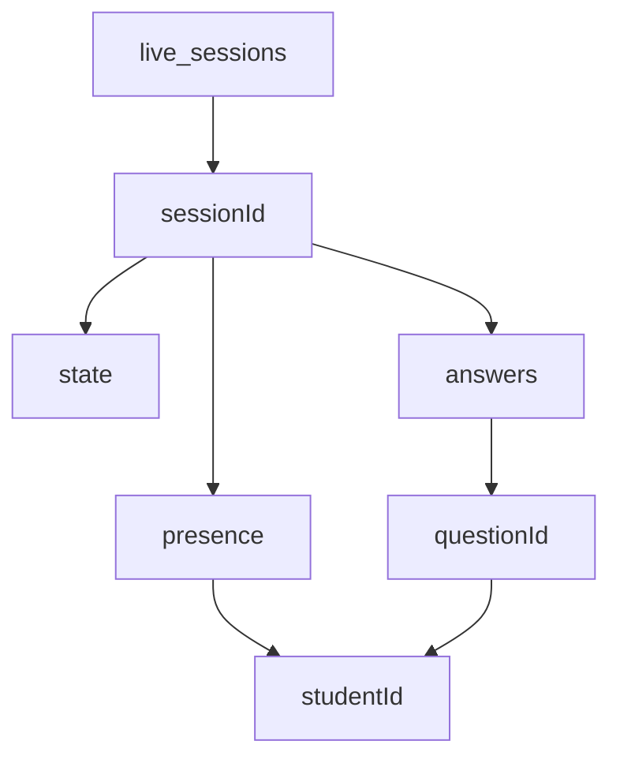

# Sprint 2.2: Realtime Database live session layer

## Scope (from [PREMIUM_ARCHITECTURE_PLAN.md](c:\Users\me\BaseCamp\PREMIUM_ARCHITECTURE_PLAN.md))

- **In scope:** Flat RTDB model under `live_sessions/{sessionId}` with `state`, `presence/{studentId}`, `answers/{questionId}/{studentId}`; persistent WebSocket client via `firebase/database`; `onDisconnect` presence tracking; server rules and deploy wiring; hook from [liveClassroomQueueBypass.ts](c:\Users\me\BaseCamp\src\services\core\liveClassroomQueueBypass.ts) so the IndexedDB bypass can target RTDB (Sprint 2.1 already calls this hook when appropriate).
- **Out of scope (per roadmap):** React "Follow Me" quiz UI and leaderboard ([Sprint 2.3](c:\Users\me\BaseCamp\PREMIUM_ARCHITECTURE_PLAN.md) ~line 245); Cloud Function on session `concluded` and Firestore batch write ([Sprint 2.4](c:\Users\me\BaseCamp\PREMIUM_ARCHITECTURE_PLAN.md) ~line 246).

## Current baseline

- [src/lib/firebase.ts](c:\Users\me\BaseCamp\src\lib\firebase.ts): initializes the default Firebase app for Firestore, Auth, and Functions; **no** `getDatabase` yet.
- [firebase.json](c:\Users\me\BaseCamp\firebase.json): `firestore` and `storage` only; **no** `database` (Realtime Database) entry yet.
- [LiveClassroomSessionContext.tsx](c:\Users\me\BaseCamp\src\context\LiveClassroomSessionContext.tsx): in-memory `isLiveSessionActive` only; RTDB will not replace this in 2.2, but 2.3 can drive both together later.

## Target RTDB tree (reference)

- **`state`:** quiz lifecycle (e.g. status, current question, timestamps) — **teacher** read/write, **student** read-only, per the architecture table (lines 44–50).
- **`presence/{studentId}`:** connection presence via **`onDisconnect`** (lines 50–55).
- **`answers/{questionId}/{studentId}`:** small primitive values (lines 55–60).

## Implementation steps and files

### 1. Config and app bootstrap

- **Modify** [src/lib/firebase.ts](c:\Users\me\BaseCamp\src\lib\firebase.ts): import `getDatabase` from `firebase/database`; call `getDatabase(app)`; pass an explicit database URL. Use env `VITE_FIREBASE_DATABASE_URL` (required in non-demo flows). If the URL is missing, either skip `getDatabase` and export `rtdb: null` with a one-time `console.warn`, or fall back to `https://<projectId>.firebaseio.com` / regional default-rtdb host — **pick one strategy** in code and document in `.env.example` so local and CI behave predictably.
- **Modify** [src/vite-env.d.ts](c:\Users\me\BaseCamp\src\vite-env.d.ts): add `VITE_FIREBASE_DATABASE_URL?` (or required if you require it everywhere).
- **Modify** [.env.example](c:\Users\me\BaseCamp\.env.example): document `VITE_FIREBASE_DATABASE_URL` and where to find it in Firebase Console (Build → Realtime Database → data tab URL).

### 2. TypeScript model and path helpers (flat paths, no deep fetch traps)

- **Create** [src/types/liveSessionRtdb.ts](c:\Users\me\BaseCamp\src\types\liveSessionRtdb.ts) (or `src/services/liveClassroom/types.ts`): strict types for `LiveSessionState` (status: `waiting` | `active` | `concluded`, `activeQuestionIndex`, optional `timestamps` / `teacherId` for future rules), `PresenceValue` (e.g. `online` boolean and `lastSeen` server time optional), and raw answer payloads (`string | number | boolean` as in the doc).
- **Create** [src/services/liveClassroom/liveSessionRtdbPaths.ts](c:\Users\me\BaseCamp\src\services\liveClassroom\liveSessionRtdbPaths.ts): string builders for `live_sessions/${sessionId}/state`, `.../presence/${studentId}`, `.../answers/${questionId}/${studentId}` so all modules share one path schema.

### 3. RTDB service layer (write, subscribe, onDisconnect)

- **Create** [src/services/liveClassroom/liveSessionRtdbService.ts](c:\Users\me\BaseCamp\src\services\liveClassroom\liveSessionRtdbService.ts):
  - Accept `Database` (or a getter) from `firebase.ts`; no-op or throw a clear error if `rtdb` is null.
  - **State:** `updateSessionState(sessionId, partial)`, `onSessionValue(sessionId, 'state', callback)` using `onValue` / `ref` + `unsubscribe` pattern.
  - **Presence:** `setStudentOnline(sessionId, studentId, online: boolean)` and **`onDisconnect`**: `onDisconnect(presenceRef).remove()` or set `{ online: false }` — match the type chosen for `PresenceValue` (the architecture emphasizes showing online/offline on the teacher dashboard; 2.2 only needs the working primitive).
  - **Answers:** `setAnswer(sessionId, questionId, studentId, value)`.
  - Use modular imports (`ref`, `set`, `update`, `onValue`, `off`, `onDisconnect`, `serverTimestamp` if using presence timestamps) from `firebase/database`.
  - Export unsubscribe functions for any subscription to avoid listener leaks in 2.3.

### 4. Realtime Database security rules and deploy

- **Create** [database.rules.json](c:\Users\me\BaseCamp\database.rules.json) at repo root: rules for `live_sessions/{sessionId}` that encode, at minimum:
  - Unauthenticated: no access.
  - `state`: reads for authenticated users; **writes** restricted so only a “teacher” can mutate global session state. Because RTDB cannot read Firestore, use one of: (a) **include `teacherId` (and optionally `cohortId`) in `state`** and validate `request.auth.uid == newData.child('teacherId').val()` for updates, with first `set` allowed to establish `teacherId`, or (b) short-term stricter but simpler: authenticated write to `state` with a `TODO` to tighten. Prefer (a) for a durable model without Cloud Function yet.
  - `presence/{studentId}`: write only if `studentId == request.auth.uid` (and matching linked-profile edge cases if you already mirror them; otherwise keep **uid path only** in 2.2 and document).
  - `answers/{qId}/{sid}`: student may write only if `sid == request.auth.uid`; teacher read; teacher no write (optional) or read-only.
- **Modify** [firebase.json](c:\Users\me\BaseCamp\firebase.json): add `"database": { "rules": "database.rules.json" }` (or the standard Firebase shape for Realtime Database rules) so `firebase deploy` can publish rules. Align with your existing deploy story (read [.cursor/rules/firestore-deploy-targets.mdc](c:\Users\me\BaseCamp\.cursor\rules\firestore-deploy-targets.mdc) if you add a new deploy script).
- **Note:** Enabling the Realtime Database in the Google Cloud / Firebase project is a **Console** step; the plan should mention creating the default instance if not already present, then copy the data URL into `.env`.

### 5. Wire Sprint 2.1 bypass to RTDB (thin bridge, not full quiz semantics)

- **Create** [src/services/liveClassroom/registerLiveClassroomRtdbBypass.ts](c:\Users\me\BaseCamp\src\services\liveClassroom\registerLiveClassroomRtdbBypass.ts) (or **modify** a single bootstrap file): call `setLiveClassroomQueueBypassHandler` from [liveClassroomQueueBypass.ts](c:\Users\me\BaseCamp\src\services\core\liveClassroomQueueBypass.ts) with a handler that:
  - Requires `getAuth().currentUser` (or the payload’s `studentId` for routing — align with 2.3).
  - Maps only what exists today: `QueuedAssessment` is worksheet-oriented, **not** the final quiz shape. For 2.2, **either** (recommended) no-op the handler except **dev** logging, **or** write a small diagnostic child e.g. `live_sessions/{sessionId}/_bypass_inbox` only when `VITE_…` is set, **or** add optional fields on the payload in a **follow-up** when live quiz events exist. The plan for 2.2 should state explicitly: **full semantic mapping of live events goes with 2.3**; 2.2 must **register** the handler and ensure RTDB is initialized so the first real live write path does not change `addToQueue`’s contract again.

- **Modify** [src/App.tsx](c:\Users\me\BaseCamp\src\App.tsx) (or [src/main.tsx](c:\Users\me\BaseCamp\src\main.tsx)): one-time `registerLiveClassroomRtdbBypass()` on app load, after Firebase app init (or inside `LoggedInApp` with `useEffect` once) so the DevTools `console.debug` from 2.1 is replaced in production with a no-op or real write path.

### 6. No changes required for these in 2.2 (unless integration forces it)

- [OfflineQueuedModal.tsx](c:\Users\me\BaseCamp\src\components\OfflineQueuedModal.tsx): not listed in Sprint 2.2; bypass UI already handled in 2.1.
- [useSyncManager.ts](c:\Users\me\BaseCamp\src\hooks\useSyncManager.ts): no change; RTDB is parallel to the offline queue.

## Verification (manual / quick)

- With valid `.env` and RTDB created in the project: app starts without throwing; `rtdb` ref logs ready in dev.
- In Firebase Console → Realtime Database: write `state` and `presence` via the new service in a small temporary dev-only `useEffect` or a unit-less manual call can be **optional**; at minimum, rules deploy succeeds (`firebase deploy --only database`).
- `onDisconnect` presence: two browser tabs, close student tab, teacher (or other tab) sees presence flip after disconnect timeout.
- **Regression:** GES / non-premium flows unchanged; Firestore and Auth still work.

## Risk / follow-up

- **RTDB + PWA / offline public tier:** The RTDB client adds WebSocket usage; do **not** add RTDB to Workbox precache in 2.2 (Pillar 4 is Phase 4). No change to [vite.config.ts](c:\Users\me\BaseCamp\vite.config.ts) unless bundle analysis shows a need to code-split the `firebase/database` entry — optional follow-up.
- **Rules complexity:** If teacher/student split is too time-consuming, ship **stricter than open** but `TODO` a hardening pass with 2.4 when session creation is server-owned.
