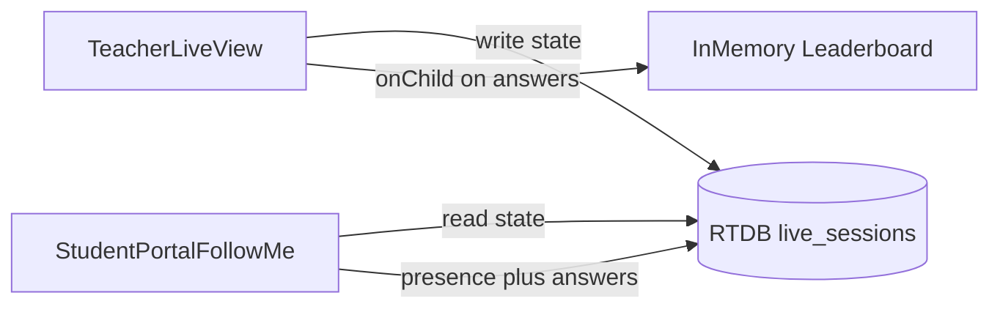

# Sprint 2.3: "Follow Me" React UI and live leaderboard

## Scope (from [PREMIUM_ARCHITECTURE_PLAN.md](c:\Users\me\BaseCamp\PREMIUM_ARCHITECTURE_PLAN.md))

- **Sprint 2.3 (lines 24–25, 245):** React components for the **Follow Me** quiz, **teacher dashboard** listening to Realtime DB for high-frequency answer updates, **live leaderboard in client memory** (child / delta listeners as specified).
- **Out of scope (Sprint 2.4):** Cloud Function on `concluded`, batch Firestore write, RTDB node deletion — teacher may still set `status: 'concluded'` in [LiveSessionState](c:\Users\me\BaseCamp\src\types\liveSessionRtdb.ts) from the client for future triggers.

## Current baseline to build on

- [liveSessionRtdbService.ts](c:\Users\me\BaseCamp\src\services\liveClassroom\liveSessionRtdbService.ts): `subscribeSessionState`, `updateSessionState`, `setStudentPresenceWithDisconnect`, `subscribePresenceMap`, `setAnswer` — **no** answer-tree delta subscription yet; teacher needs **child** listeners on `live_sessions/{sessionId}/answers`.
- [LiveClassroomSessionContext.tsx](c:\Users\me\BaseCamp\src\context\LiveClassroomSessionContext.tsx): only `isLiveSessionActive` boolean; no **session id** or RTDB session lifecycle.
- [LoggedInAppChrome.tsx](c:\Users\me\BaseCamp\src\components\layout\LoggedInAppChrome.tsx): `View` union + `switch` render; teacher nav is hardcoded; no live-classroom route.
- [StudentPortalApp.tsx](c:\Users\me\BaseCamp\src\features\students\StudentPortalApp.tsx): today’s quiz is **Firestore** `students/{id}.activeQuiz`; Follow Me in 2.3 should be a **parallel** RTDB path (join by `sessionId`) so GES / legacy flows are untouched when Premium RTDB is off.
- [PremiumTierContext.tsx](c:\Users\me\BaseCamp\src\context\PremiumTierContext.tsx): use for **gating** any new primary nav and views.

## Architecture (Sprint 2.3)

## 1. Extend the RTDB model (minimal, for a real UI)

- **Modify** [src/types/liveSessionRtdb.ts](c:\Users\me\BaseCamp\src\types\liveSessionRtdb.ts): add optional fields the teacher can write under `state` for a usable quiz (e.g. `roundTitle`, `activeQuestion: { id: string, prompt: string, options: string[] }` or a small `questions` array and `activeQuestionId`). Keep everything JSON-friendly for RTDB. **Do not** duplicate Firestore `GamifiedQuiz` unless you explicitly consolidate later.
- **Optional:** **Modify** [database.rules.json](c:\Users\me\BaseCamp\database.rules.json) only if new validation is required; existing `state` write rule (teacher `teacherId` ownership) should still apply if all quiz metadata lives under the same `state` object / shallow updates.

## 2. Service layer: answer deltas for the teacher

- **Modify** [src/services/liveClassroom/liveSessionRtdbService.ts](c:\Users\me\BaseCamp\src\services\liveClassroom\liveSessionRtdbService.ts):
  - Add **`subscribeAnswersDeltas` (or similar)** that attaches **`onChildAdded` / `onChildChanged` / `onChildRemoved`** at `live_sessions/{sessionId}/answers` and, for each question id child, subscribes to child events for **student** keys (or uses a second-level pattern that matches the existing path layout in [liveSessionRtdbPaths.ts](c:\Users\me\BaseCamp\src\services\liveClassroom\liveSessionRtdbPaths.ts)). Cleanup all listeners on uninstall.
  - If nested subscriptions are too heavy for the first pass, **document in code** a fallback: a single `onValue` on `.../answers` to rebuild the in-memory map (acceptable for 2.3 scale); prefer the sprint’s **child** APIs where practical.
- **Add** a small **pure** helper, e.g. [src/utils/liveSessionLeaderboard.ts](c:\Users\me\BaseCamp\src\utils\liveSessionLeaderboard.ts): fold incoming `(questionId, studentId, value)` events into a **sortable** leaderboard structure (MVP: sum scores if values are numbers, or 1/0 for correct if you add a `correct` field later).

## 3. React hooks (keep components thin)

- **Create** [src/hooks/useTeacherLiveSession.ts](c:\Users\me\BaseCamp\src\hooks\useTeacherLiveSession.ts) (or `src/features/liveClassroom/hooks/…`): `sessionId`, `createSession` / `endSession` (updates `state` including `teacherId: auth.currentUser!.uid` on first write per [Sprint 2.2](c:\Users\me\BaseCamp\database.rules.json) rules), `error`, loading, subscribe/unsubscribe to state + presence + answer deltas, expose **leaderboard rows** and **presence map**.
- **Create** [src/hooks/useStudentLiveSession.ts](c:\Users\me\BaseCamp\src\hooks\useStudentLiveSession.ts): for `sessionId` + `studentId` (portal user): subscribe to `state`, call `setStudentPresenceWithDisconnect` once when entering the round, `setAnswer` on submit, read-only UI for the active question (from `state`).

## 4. Session context: tie UI to a concrete session id

- **Modify** [src/context/LiveClassroomSessionContext.tsx](c:\Users\me\BaseCamp\src\context\LiveClassroomSessionContext.tsx): add **`activeSessionId: string | null`**, setters, and have **`beginLiveSession` / `endLiveSession`** update both `isLiveSessionActive` and `activeSessionId` (generate id with `crypto.randomUUID` or `push` key—prefer **static uuid** to avoid a write round-trip before the first `state` write). Teacher dashboard and (optional) other consumers read this from context.

## 5. Teacher UI: new app view

- **Create** [src/features/liveClassroom/TeacherLiveClassroomPanel.tsx](c:\Users\me\BaseCamp\src\features\liveClassroom\TeacherLiveClassroomPanel.tsx) (or `TeacherLiveSessionDashboard.tsx`): Premium-only panel: start round (writes initial `state` + first question or placeholder), show **connection/presence** list, show **answer stream / leaderboard** table, copy **join link** (build URL for student portal with hash query — e.g. `#/portal?liveSession=<id>`; exact shape codified in one helper [src/utils/studentPortalLiveLink.ts](c:\Users\me\BaseCamp\src\utils\studentPortalLiveLink.ts)), “End session” (sets `concluded`).
- **Modify** [src/components/layout/LoggedInAppChrome.tsx](c:\Users\me\BaseCamp\src\components\layout\LoggedInAppChrome.tsx):
  - Extend [View](c:\Users\me\BaseCamp\src\components\layout\LoggedInAppChrome.tsx) with `'live-classroom'`.
  - In `renderContent` `switch`, add case for `'live-classroom'` rendering the new panel.
  - Add a **nav item** for `teacher` and `headteacher` (and optionally other staff roles that should run a class) **only when** `usePremiumTier().isPremiumTier` and `VITE_FIREBASE_DATABASE_URL` / `rtdb` is effectively usable (or show panel with a clear “configure RTDB” message if `rtdb` is null — match existing [firebase.ts](c:\Users\me\BaseCamp\src\lib\firebase.ts) pattern).

## 6. Student UI: join path in the portal

- **Modify** [src/features/students/StudentPortalApp.tsx](c:\Users\me\BaseCamp\src\features\students\StudentPortalApp.tsx):
  - Parse **hash or search params** for `liveSession` (or `session`) id.
  - After the student is identified (existing portal code flow), if `liveSession` is present and `rtdb` is available, render a **new** subcomponent [src/features/liveClassroom/StudentFollowMeSession.tsx](c:\Users\me\BaseCamp\src\features\liveClassroom\StudentFollowMeSession.tsx) that uses `useStudentLiveSession` and does **not** depend on `activeQuiz` Firestore.
  - If RTDB is not configured or no session id, keep current **Firestore** practice experience unchanged.
- **Wire** [auth.currentUser](c:\Users\me\BaseCamp\src\lib\firebase.ts) for portal: if students use a different auth model (anonymous vs `student_portal` claims), **ensure** `studentId` used in RTDB paths matches **`auth.uid`** for [database.rules.json](c:\Users\me\BaseCamp\database.rules.json) `presence`/`answers` child keys — the plan may require a one-line **doc note** in code if the portal uses a custom uid mapping (inspect existing portal sign-in in [StudentPortalApp](c:\Users\me\BaseCamp\src\features\students\StudentPortalApp.tsx) and [student service](c:\Users\me\BaseCamp\src\services\studentService.ts) before implementation).

## 7. App wiring

- **Modify** [src/App.tsx](c:\Users\me\BaseCamp\src\App.tsx) only if `LiveClassroomSessionProvider` must wrap with new default props — likely **not** required beyond context API extension.
- **No** change to [registerLiveClassroomRtdbBypass.ts](c:\Users\me\BaseCamp\src\services\liveClassroom\registerLiveClassroomRtdbBypass.ts) unless you unify bypass → live session (optional follow-up); 2.3 focuses on the **explicit** Follow Me RTDB path.

## 8. Testing / verification (manual)

- Premium teacher: open **Live classroom** view, start session, see own `state` in Console or UI.
- Second browser / incognito: student portal join link, answer updates teacher leaderboard within a second, presence flips on tab close (onDisconnect).
- Non-premium or missing DB URL: no regression on class roster, new assessment, or GES users.

## Files summary

| Action | File |
|--------|------|
| Modify | [src/types/liveSessionRtdb.ts](c:\Users\me\BaseCamp\src\types\liveSessionRtdb.ts) |
| Modify | [src/services/liveClassroom/liveSessionRtdbService.ts](c:\Users\me\BaseCamp\src\services\liveClassroom\liveSessionRtdbService.ts) |
| Create | [src/utils/liveSessionLeaderboard.ts](c:\Users\me\BaseCamp\src\utils\liveSessionLeaderboard.ts) (optional but keeps UI clean) |
| Create | [src/hooks/useTeacherLiveSession.ts](c:\Users\me\BaseCamp\src\hooks\useTeacherLiveSession.ts) |
| Create | [src/hooks/useStudentLiveSession.ts](c:\Users\me\BaseCamp\src\hooks\useStudentLiveSession.ts) |
| Modify | [src/context/LiveClassroomSessionContext.tsx](c:\Users\me\BaseCamp\src\context\LiveClassroomSessionContext.tsx) |
| Create | [src/features/liveClassroom/TeacherLiveClassroomPanel.tsx](c:\Users\me\BaseCamp\src\features\liveClassroom\TeacherLiveClassroomPanel.tsx) |
| Create | [src/features/liveClassroom/StudentFollowMeSession.tsx](c:\Users\me\BaseCamp\src\features\liveClassroom\StudentFollowMeSession.tsx) |
| Create | [src/utils/studentPortalLiveLink.ts](c:\Users\me\BaseCamp\src\utils\studentPortalLiveLink.ts) |
| Modify | [src/components/layout/LoggedInAppChrome.tsx](c:\Users\me\BaseCamp\src\components\layout\LoggedInAppChrome.tsx) |
| Modify | [src/features/students/StudentPortalApp.tsx](c:\Users\me\BaseCamp\src\features\students\StudentPortalApp.tsx) |
| Optional modify | [database.rules.json](c:\Users\me\BaseCamp\database.rules.json) if state shape requires stricter validation |
