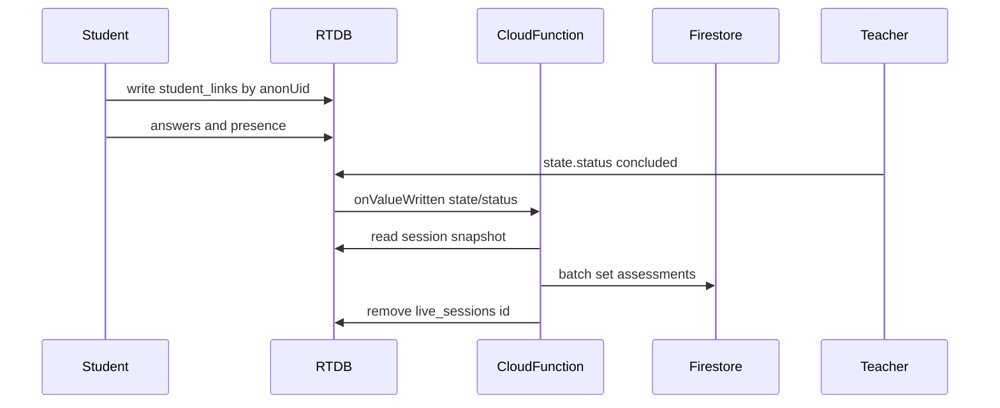

# Sprint 2.4: Live session end → Firestore + RTDB cleanup

## Context (from [PREMIUM_ARCHITECTURE_PLAN.md](c:\Users\me\BaseCamp\PREMIUM_ARCHITECTURE_PLAN.md))

When `/live_sessions/{sessionId}/state/status` is set to `concluded`, a backend function should: read `answers`, grade, batch-write to Firestore `assessments`, then delete `/live_sessions/{sessionId}`.

## Critical design gap: anonymous keys vs. Firestore `studentId`

- Answers and presence use **anonymous `auth.uid`** as the RTDB key (see [useStudentLiveSession.ts](c:\Users\me\BaseCamp\src\hooks\useStudentLiveSession.ts) calling `setAnswer` / `setStudentPresenceWithDisconnect` with `authUser.uid`).
- The portal knows the real learner id as **`studentId` from the class code** ([StudentPortalApp.tsx](c:\Users\me\BaseCamp\src\features\students\StudentPortalApp.tsx)), but that id is **not** currently written to RTDB.

**Sprint 2.4 must add a small RTDB “link” step** so the function can build valid `Assessment` rows:

- Proposed path: `live_sessions/{sessionId}/student_links/{anonUid}` → `{ firestoreStudentId: "<id>" }` (exact shape can match your naming preference, but must be unambiguous for Admin reads).
- **RTDB rules** in [database.rules.json](c:\Users\me\BaseCamp\database.rules.json): allow write only if `auth.uid == anonUid` and the payload is a small validated object (string `firestoreStudentId`).

## Trigger shape (align with existing functions stack)

- Use **2nd gen** `onValueWritten` from `firebase-functions/v2/providers/database` (available in the installed `firebase-functions` 6.x; see `lib/v2/providers/database.d.ts` in the package) with:
  - `ref: 'live_sessions/{sessionId}/state/status'`
  - `region`: same as other jobs ([functions/src/index.ts](c:\Users\me\BaseCamp\functions\src\index.ts) uses `REGION` default `europe-west1`)
  - `memory` / `timeoutSeconds`: enough for a class-scale batch (e.g. 512MiB–1GiB, up to 540s like other jobs)
- **Handler guardrails**: use `Change<DataSnapshot>`; run the heavy work only when `after` exists, `val() === 'concluded'`, and `before` is not already `concluded` (avoids double work on unrelated writes if the path is co-updated, and handles edge cases from emulator retries).

## Grading and Firestore document shape

- **Inputs**: `state.questions` (array with `id`, `correctIndex`) from [LiveSessionState](c:\Users\me\BaseCamp\src\types\liveSessionRtdb.ts), `answers[questionId][anonUid]`, and `student_links[anonUid].firestoreStudentId`.
- **Per-student score**: e.g. percent correct over questions that have an answer (define one clear rule in code, e.g. “grade all questions in `state.questions`, missing answer counts as wrong”).
- **Firestore** ([Assessment](c:\Users\me\BaseCamp\src\types\domain.ts)): populate required/rollup fields: `studentId`, `type` (use `'Numeracy'` for the current demo / MCQ, or drive from `state` later), `diagnosis` (e.g. include `roundTitle` / “Live session”), `timestamp` (server timestamp or `endedAtMs` from state), `status: 'Completed'`, `score` (0–100), `updatedAt` (ms), plus denorm fields for staff queries: load `students/{id}` (and `cohorts/{cohortId}` if needed) via Admin to fill `cohortId`, `cohortTeacherId`, `schoolId`, and `classLabel` if available.
- **Optional traceability** (small, high value): set `createdByUserId` from `state.teacherId` and optionally add a dedicated optional string field on `Assessment` (e.g. `liveSessionId`) in `domain.ts` if you want explicit filtering—only if you want this sprint to tag live rows without inferring from `diagnosis`.

## Idempotency and batching

- **Idempotency**: before writing assessments, use a **Firestore “done” marker** document keyed by `sessionId` (e.g. `live_session_persisted/{sessionId}` with `processedAt` and maybe `assessmentCount`) created in a transaction or as the first write. If the function retries after partial success, skip duplicate assessment creation.
- **Deterministic assessment IDs**: e.g. `assessments` doc id `ls_{sessionId}_{firestoreStudentId}` so retries upsert the same document instead of duplicating.
- **Batching**: cap each commit at Firestore’s 500-op limit; chunk if many students.

## RTDB delete

- After successful Firestore commit(s), `getDatabase().ref('live_sessions/' + sessionId).remove()` (Admin SDK) or equivalent modular API.

## Files to create

| File | Role |
|------|------|
| [functions/src/liveSessionConcluded.ts](c:\Users\me\BaseCamp\functions\src\liveSessionConcluded.ts) (name flexible) | Export `onValueWritten` handler wiring + logger |
| [functions/src/lib/persistLiveSessionToFirestore.ts](c:\Users\me\BaseCamp\functions\src\lib\persistLiveSessionToFirestore.ts) (or single module) | Pure parsing/grading, Firestore batching, idempotency, RTDB delete |

## Files to modify

| File | Change |
|------|--------|
| [functions/src/index.ts](c:\Users\me\BaseCamp\functions\src\index.ts) | Import `getDatabase` from `firebase-admin/database` if not present; register new RTDB function export; initialize Admin app unchanged |
| [database.rules.json](c:\Users\me\BaseCamp\database.rules.json) | Add `student_links` (or chosen name) sub-rules under `$sessionId` |
| [src/services/liveClassroom/liveSessionRtdbPaths.ts](c:\Users\me\BaseCamp\src\services\liveClassroom\liveSessionRtdbPaths.ts) | Path helper for `student_links` |
| [src/services/liveClassroom/liveSessionRtdbService.ts](c:\Users\me\BaseCamp\src\services\liveClassroom\liveSessionRtdbService.ts) | New function: write student link after anonymous auth is ready |
| [src/hooks/useStudentLiveSession.ts](c:\Users\me\BaseCamp\src\hooks\useStudentLiveSession.ts) | New optional arg `firestoreStudentId: string \| null`; call link writer when both ids exist |
| [src/features/liveClassroom/StudentFollowMeSession.tsx](c:\Users\me\BaseCamp\src\features\liveClassroom\StudentFollowMeSession.tsx) | Pass `firestoreStudentId` into the hook |
| [src/features/students/StudentPortalApp.tsx](c:\Users\me\BaseCamp\src\features\students\StudentPortalApp.tsx) | Pass `studentId` (already in scope) into `StudentFollowMeSession` |
| [src/types/liveSessionRtdb.ts](c:\Users\me\BaseCamp\src\types\liveSessionRtdb.ts) | Type for the link value object (optional) |

**Optional (types only):** [src/types/domain.ts](c:\Users\me\BaseCamp\src\types\domain.ts) if you add `liveSessionId` to `Assessment`.

## Deploy / config notes (no file edits required unless something is missing)

- [firebase.json](c:\Users\me\BaseCamp\firebase.json) already has `database` rules and `functions`; RTDB v2 triggers deploy with the same `functions` codebase—ensure the project’s **default Realtime Database URL** matches the app’s `VITE_FIREBASE_DATABASE_URL` (Admin uses the default instance unless you pass a named `instance` in the trigger options for multi-DB).
- [firestore.rules](c:\Users\me\BaseCamp\firestore.rules) **does not** need to change for Admin-written `assessments` (bypasses rules), unless you add a new client-read collection for the done-marker (prefer keeping the marker function-only and rely on no client access).

## Verification

- **Unit-style**: pure grading function (correctIndex vs. submitted index) in `functions/src/lib/`.
- **Emulator or staging**: end a session with two browsers; confirm `student_links` present, one assessment per known student, RTDB path removed, and idempotent re-invocation (manually re-run or retry) does not duplicate assessments when the marker doc exists.
