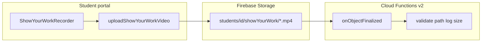

# Sprint 3.2 — Storage `onObjectFinalized` (Gen2) + upload path

## Scope (from [PREMIUM_ARCHITECTURE_PLAN.md](c:\Users\me\BaseCamp\PREMIUM_ARCHITECTURE_PLAN.md))

- **In scope:** A **2nd generation** Cloud Function triggered when a finalized object lands in Firebase Storage, with **`timeoutSeconds: 540`**, **`memory: "4GiB"`** (unlocks **2 vCPUs** per the doc’s CPU/memory coupling), and **`concurrency: 80`** as in the “Optimal Cloud Function Configuration Profile” table (lines 110–118).
- **Explicitly out of scope for 3.2 (per roadmap):** Gemini 3 Flash, multimodal inference, and teacher-dashboard UI for results — those are **Sprint 3.3**.

## Why a small client upload is part of this sprint

The roadmap sentence for 3.2 only names the function, but the architecture flow is “upload → trigger” ([lines 100–106](c:\Users\me\BaseCamp\PREMIUM_ARCHITECTURE_PLAN.md)). Today, [StudentPortalApp](c:\Users\me\BaseCamp\src\features\students\StudentPortalApp.tsx) only handles `onRecordingComplete` in **dev** (download stub). Without a real upload, the new function cannot be integration-tested. [storage.rules](c:\Users\me\BaseCamp\storage.rules) already allows **`student_portal`** writes under **`students/{studentId}/**`** when `portalStudentId` / `portalSessionToken` match — so uploads should use that prefix.

## Storage object contract

- **Path:** `students/{studentId}/showYourWork/{timestampOrUuid}.mp4` (fixed prefix `showYourWork/` so the trigger ignores unrelated student files).
- **Content-Type:** `video/mp4` on upload.
- **Optional metadata:** e.g. `customMetadata.encoder` (`webcodecs` | `ffmpeg`) for observability (Sprint 3.3 can use it).

## Backend implementation

| Action | File | Details |
|--------|------|--------|
| **Create** | [functions/src/onShowYourWorkVideoFinalized.ts](c:\Users\me\BaseCamp\functions\src\onShowYourWorkVideoFinalized.ts) | Export a factory `createOnShowYourWorkVideoFinalized(region)` (same pattern as [liveSessionConcluded.ts](c:\Users\me\BaseCamp\functions\src\liveSessionConcluded.ts)) wrapping **`onObjectFinalized`** from `firebase-functions/v2/storage`. Options: **`region`**, **`memory: '4GiB'`**, **`timeoutSeconds: 540`**, **`cpu: 2`**, **`concurrency: 80`**. Optionally set **`bucket`** explicitly if the default bucket name must be pinned (match `VITE_FIREBASE_STORAGE_BUCKET`). |
| **Create** (optional, small) | [functions/src/lib/showYourWorkObject.ts](c:\Users\me\BaseCamp\functions\src\lib\showYourWorkObject.ts) | Parse `event.data.name`, enforce prefix + `.mp4`, extract `studentId`, return `null` if not a show-your-work object (early return in handler). Optionally cap **`size`** (e.g. skip or log+return if over ~25–50 MB). |
| **Modify** | [functions/src/index.ts](c:\Users\me\BaseCamp\functions\src\index.ts) | Import and **`export const onShowYourWorkVideoFinalized = createOnShowYourWorkVideoFinalized(REGION)`** next to existing exports; reuse existing **`REGION`** constant. |

**Handler body (3.2 only):** structured **`logger.info`** / **`logger.warn`** with `studentId`, `bucket`, `name`, `size`, `contentType`; no `@google/generative-ai` calls, no new secrets. Optionally use **`getStorage().bucket().file(name).exists()`** or rely on event payload only — keep I/O minimal.

**Build:** Run `npm run build` in `functions` (existing `tsc`).

**Deploy:** `firebase deploy --only functions:onShowYourWorkVideoFinalized` (or full functions) per your workflow; ensure the project’s default Storage bucket matches client config.

## Client implementation (minimal, for E2E)

| Action | File | Details |
|--------|------|--------|
| **Modify** | [src/lib/firebase.ts](c:\Users\me\BaseCamp\src\lib\firebase.ts) | **`getStorage(app)`** and export **`storage`** (guarded when `hasValidConfig` is false, similar to `rtdb`). |
| **Create** | [src/features/students/showYourWork/uploadShowYourWorkVideo.ts](c:\Users\me\BaseCamp\src\features\students\showYourWork\uploadShowYourWorkVideo.ts) | **`uploadBytes`** (or resumable if you expect larger files) to **`ref(storage, \`students/${studentId}/showYourWork/${Date.now()}.mp4\`)`** with **`contentType: 'video/mp4'`** and small **`customMetadata`**. |
| **Modify** | [src/features/students/StudentPortalApp.tsx](c:\Users\me\BaseCamp\src\features\students\StudentPortalApp.tsx) | In `onRecordingComplete`, when **`storage`** is available: **`await uploadShowYourWorkVideo(...)`**; keep **`import.meta.env.DEV`** download/logging as optional QA; surface a short user-visible success/error message (e.g. local state or `error` prop) so failures are not silent in production. |

No changes to [storage.rules](c:\Users\me\BaseCamp\storage.rules) if paths stay under `students/{studentId}/**` with existing portal checks.

## Verification

- Upload a short MP4 from the portal (Cambridge/both school); confirm function logs in Cloud Logging and no timeout on small files.
- Upload to a path **outside** `showYourWork/` (manual console test) and confirm the function **no-ops** quickly.
- **`npm run lint`** / **`functions` `npm run lint`** as usual.

## Files summary

| Path | Create / Modify |
|------|-----------------|
| [functions/src/onShowYourWorkVideoFinalized.ts](c:\Users\me\BaseCamp\functions\src\onShowYourWorkVideoFinalized.ts) | **Create** |
| [functions/src/lib/showYourWorkObject.ts](c:\Users\me\BaseCamp\functions\src\lib\showYourWorkObject.ts) | **Create** (optional) |
| [functions/src/index.ts](c:\Users\me\BaseCamp\functions\src\index.ts) | **Modify** |
| [src/lib/firebase.ts](c:\Users\me\BaseCamp\src\lib\firebase.ts) | **Modify** |
| [src/features/students/showYourWork/uploadShowYourWorkVideo.ts](c:\Users\me\BaseCamp\src\features\students\showYourWork\uploadShowYourWorkVideo.ts) | **Create** |
| [src/features/students/StudentPortalApp.tsx](c:\Users\me\BaseCamp\src\features\students\StudentPortalApp.tsx) | **Modify** |

**Not in 3.2:** [firestore.rules](c:\Users\me\BaseCamp\firestore.rules), Gemini, new Firestore collections for teacher-facing insights (defer to 3.3 unless you want a `pending` job doc now — optional and not required by the roadmap text).
