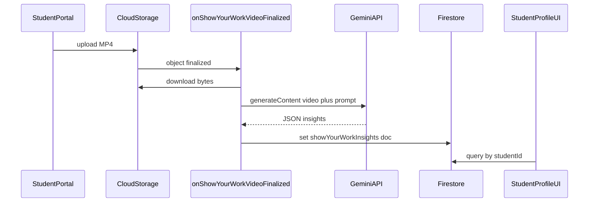

# Sprint 3.3 — Gemini multimodal video insights + teacher UI

## Scope (from [PREMIUM_ARCHITECTURE_PLAN.md](c:\Users\me\BaseCamp\PREMIUM_ARCHITECTURE_PLAN.md))

- **In scope:** Use **Gemini** (architecture: **Gemini 3 Flash** class model) inside the **same Gen2** `onObjectFinalized` pipeline to analyze **speech cadence**, **vocabulary**, and **visual / problem-solving sequence** from the compressed MP4; **persist** results for staff; **show** them on the **teacher (staff) dashboard** path — here: [Student profile](c:\Users\me\BaseCamp\src\features\students\StudentProfile.tsx).
- **Already in place:** [onShowYourWorkVideoFinalized.ts](c:\Users\me\BaseCamp\functions\src\onShowYourWorkVideoFinalized.ts) (4GiB / 2 vCPU / 540s / concurrency 80), path parsing [showYourWorkObject.ts](c:\Users\me\BaseCamp\functions\src\lib\showYourWorkObject.ts), client upload to `students/{id}/showYourWork/*.mp4`.
- **Out of scope (later sprints):** Geometric SVG/TikZ (3.4), parent-facing portal for this feed, editing/deleting insights from the client.

## Architecture

## 1. Cloud Function — Gemini + persistence

| Action | File | Details |
|--------|------|--------|
| **Create** | [functions/src/lib/showYourWorkGemini.ts](c:\Users\me\BaseCamp\functions\src\lib\showYourWorkGemini.ts) | Build prompt aligned with Pillar 2 (speech cadence, specialized vocabulary, visual problem-solving steps). Use `@google/generative-ai` like [weeklyParentDigestPrompt.ts](c:\Users\me\BaseCamp\functions\src\lib\weeklyParentDigestPrompt.ts): `GoogleGenerativeAI`, `getGenerativeModel`. Pass video as **`inlineData`** `{ mimeType: 'video/mp4', data: base64 }` for typical clip sizes; if you hit **request size limits**, fall back to the **Files API** / chunked upload (document the threshold in code comments). Model name: reuse env pattern **`GEMINI_MODEL`** with default matching digest (`gemini-3-flash-preview` in [weeklyParentDigest.ts](c:\Users\me\BaseCamp\functions\src\weeklyParentDigest.ts) line 15) unless you standardize on another ID. Require **strict JSON** in the prompt; parse with **`JSON.parse(cleanJsonResponse(text))`** via [cleanJsonResponse.ts](c:\Users\me\BaseCamp\functions\src\lib\cleanJsonResponse.ts). Define a small **TypeScript type** for the parsed object (e.g. `speechCadence`, `vocabularyHighlights`, `problemSolvingSteps`, `teacherSummary`, `limitations`). |
| **Create** | [functions/src/lib/processShowYourWorkVideo.ts](c:\Users\me\BaseCamp\functions\src\lib\processShowYourWorkVideo.ts) | Orchestration: inputs `bucket`, `objectName`, `studentId`, `encoder`, `size`, `generation` (from event). **Download** with `getStorage().bucket(bucket).file(objectName).download()`. Load **`students/{studentId}`** with Admin Firestore for **`schoolId`** (denormalize on insight doc for rules/queries). Call `runShowYourWorkGemini(...)`. **Write** `showYourWorkInsights/{docId}` (auto id) with: `studentId`, `schoolId`, `storagePath`, `storageGeneration`, `encoder`, `contentType`, `sizeBytes`, `createdAt` (server timestamp), `model`, `status: 'completed' \| 'failed'`, `insights` (object) or `error` (string). On Gemini/parse failure, still write **`status: 'failed'`** so teachers see errors instead of silent drops. Optional: **dedupe** by querying existing doc with same `storageGeneration` + `storagePath` before writing (avoids duplicate runs if Eventarc retries). |
| **Modify** | [functions/src/onShowYourWorkVideoFinalized.ts](c:\Users\me\BaseCamp\functions\src\onShowYourWorkVideoFinalized.ts) | After validation, call `processShowYourWorkVideo(...)`. Accept **`SecretParam`** (or pass `defineSecret` from index) and add **`secrets: [geminiApiKey]`** to `onObjectFinalized` options (same mechanism as [index.ts](c:\Users\me\BaseCamp\functions\src\index.ts) `weeklyParentDigestJob`). Read API key via `.value()` inside handler. |
| **Modify** | [functions/src/index.ts](c:\Users\me\BaseCamp\functions\src\index.ts) | Pass **`geminiApiKey`** into `createOnShowYourWorkVideoFinalized` so the storage function is granted the secret (reuse existing `defineSecret('GEMINI_API_KEY')`). |

**Resource profile:** Keep existing **4GiB / cpu 2 / 540s / concurrency 80** — already appropriate for video buffer + API.

## 2. Firestore — rules + index

| Action | File | Details |
|--------|------|--------|
| **Modify** | [firestore.rules](c:\Users\me\BaseCamp\firestore.rules) | Add **`match /showYourWorkInsights/{insightId}`**. **`allow write: if false`** (Admin SDK only). **`allow read`:** mirror [voiceObservations](c:\Users\me\BaseCamp\firestore.rules) pattern — `isAdmin()`, teacher via **`isTeacherOfCohort`** on `students/{studentId}.cohortId`, headteacher **`schoolId`**, jurisdiction / org oversight via **`orgIdForSchoolId`** and **`getUserOrgId()`**, using **`resource.data.studentId`**. Requires **`studentId`** on every doc (processor must set it). |
| **Modify** | [firestore.indexes.json](c:\Users\me\BaseCamp\firestore.indexes.json) | Composite index: collection **`showYourWorkInsights`**, fields **`studentId` ASC**, **`createdAt` DESC** (for “latest first” list). |

Deploy order reminder: **`firestore:indexes`** before relying on the client query in prod.

## 3. Teacher UI — student profile

| Action | File | Details |
|--------|------|--------|
| **Create** | [src/hooks/useShowYourWorkInsights.ts](c:\Users\me\BaseCamp\src\hooks\useShowYourWorkInsights.ts) | `query(collection(db, 'showYourWorkInsights'), where('studentId', '==', id), orderBy('createdAt', 'desc'), limit(10))` + `onSnapshot`. Handle empty/error; expose `insights`, `loading`. |
| **Create** | [src/features/students/ShowYourWorkInsightsPanel.tsx](c:\Users\me\BaseCamp\src\features\students\ShowYourWorkInsightsPanel.tsx) | Present list or latest card: timestamp, short teacher summary, expandable detail (steps, vocabulary, cadence). No video playback required for 3.3 unless you add Storage download URLs later (optional). |
| **Modify** | [src/features/students/StudentProfile.tsx](c:\Users\me\BaseCamp\src\features\students\StudentProfile.tsx) | Render **`ShowYourWorkInsightsPanel`** when **`selectedStudentId`** is set and the tenant is **Premium + Cambridge/blended** — same effective gate as other premium features: **`usePremiumTier()`** from [PremiumTierContext.tsx](c:\Users\me\BaseCamp\src\context\PremiumTierContext.tsx) plus **`useSchoolConfig`** **`curriculumType`** `cambridge` \| `both` (same idea as [StudentPortalApp](c:\Users\me\BaseCamp\src\features\students\StudentPortalApp.tsx) show-your-work gate). Place in **analytical** or **family-record** tab where teachers already review context (your choice; analytical is a natural fit). |

**Note:** Staff users are **not** anonymous; `usePremiumTier()` works here unlike the student portal.

## 4. Docs / ops

| Action | File | Details |
|--------|------|--------|
| **Modify** | [functions/DEPLOY.md](c:\Users\me\BaseCamp\functions\DEPLOY.md) | One paragraph: **`onShowYourWorkVideoFinalized`** now requires **`GEMINI_API_KEY`** secret (same as weekly digest); redeploy after secret is set. |

## 5. Verification

- Upload clip from portal → Firestore doc appears under **`showYourWorkInsights`** with **`status: 'completed'`** and populated **`insights`**.
- Open student profile as teacher (Premium Cambridge school) → panel shows the new row.
- Force Gemini error (invalid key) → doc **`failed`**, UI shows error state gracefully.
- **`npm run build`** in **`functions`**, root **`tsc`**, **`firebase deploy --only functions:onShowYourWorkVideoFinalized,firestore:indexes,firestore:rules`** (adjust to your workflow).

## Files summary

| Path | Create / Modify |
|------|-----------------|
| [functions/src/lib/showYourWorkGemini.ts](c:\Users\me\BaseCamp\functions\src\lib\showYourWorkGemini.ts) | **Create** |
| [functions/src/lib/processShowYourWorkVideo.ts](c:\Users\me\BaseCamp\functions\src\lib\processShowYourWorkVideo.ts) | **Create** |
| [functions/src/onShowYourWorkVideoFinalized.ts](c:\Users\me\BaseCamp\functions\src\onShowYourWorkVideoFinalized.ts) | **Modify** |
| [functions/src/index.ts](c:\Users\me\BaseCamp\functions\src\index.ts) | **Modify** |
| [firestore.rules](c:\Users\me\BaseCamp\firestore.rules) | **Modify** |
| [firestore.indexes.json](c:\Users\me\BaseCamp\firestore.indexes.json) | **Modify** |
| [src/hooks/useShowYourWorkInsights.ts](c:\Users\me\BaseCamp\src\hooks\useShowYourWorkInsights.ts) | **Create** |
| [src/features/students/ShowYourWorkInsightsPanel.tsx](c:\Users\me\BaseCamp\src\features\students\ShowYourWorkInsightsPanel.tsx) | **Create** |
| [src/features/students/StudentProfile.tsx](c:\Users\me\BaseCamp\src\features\students\StudentProfile.tsx) | **Modify** |
| [functions/DEPLOY.md](c:\Users\me\BaseCamp\functions\DEPLOY.md) | **Modify** (short secret note) |
