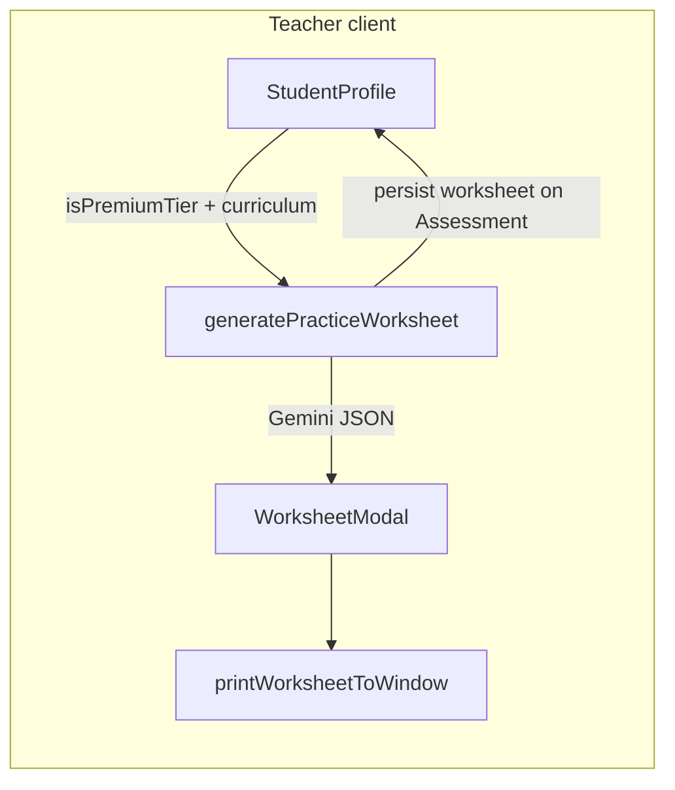

# Sprint 3.4 — Geometric generation (Gemini prompts + UI)

## Scope (from [PREMIUM_ARCHITECTURE_PLAN.md](c:\Users\me\BaseCamp\PREMIUM_ARCHITECTURE_PLAN.md))

- **Non-Premium / GES-oriented (offline tier):** Prompt Gemini to emit **TikZ/LaTeX** suitable for eventual PDF compilation; persist with the worksheet payload.
- **Premium tier:** Use **structured JSON** (ideally `responseMimeType: application/json` + schema) with **SVG-friendly data** (prefer path/circle/line objects over raw markup) for React rendering; leave room for **motion** (Phase 4.2 / LazyMotion) via a small wrapper—[`motion`](c:\Users\me\BaseCamp\package.json) is already a dependency.

**Reality check:** The doc’s “Node.js service compiles TikZ into PDF” is **not implemented today**; printing uses [`printWorksheetToWindow`](c:\Users\me\BaseCamp\src\utils\printUtils.tsx) (HTML + KaTeX). This sprint should **ship the data model + prompts + UI/print behavior**; a dedicated LaTeX/Cloud Run compile step is a **follow-on** unless you explicitly expand scope.

## Branching rule

- **`isPremiumTier === true`** ([`usePremiumTier`](c:\Users\me\BaseCamp\src\context\PremiumTierContext.tsx)): Premium geometry branch (schema + structured figures).
- **`isPremiumTier === false`**: GES/offline geometry branch (TikZ blocks in JSON fields).

Pass `isPremiumTier` from [`StudentProfile.tsx`](c:\Users\me\BaseCamp\src\features\students\StudentProfile.tsx) into [`generatePracticeWorksheet`](c:\Users\me\BaseCamp\src\services\ai\aiPrompts\worksheetGeneration.ts) alongside existing `curriculumType` (still use [`resolveAiCurriculumPromptType`](c:\Users\me\BaseCamp\src\services\ai\aiPrompts\utils.ts) for pedagogy alignment).

## 1. Types and persistence shape

| File | Change |
|------|--------|
| [`src/services/ai/aiPrompts/types.ts`](c:\Users\me\BaseCamp\src\services\ai\aiPrompts\types.ts) | Extend [`WorksheetResult`](c:\Users\me\BaseCamp\src\services\ai\aiPrompts\types.ts): keep `title` + `questions`. Add optional **parallel arrays** (same length as `questions`, entries nullable): e.g. `premiumFigures?: (WorksheetPremiumFigure \| null)[]` and `gesTikzFigures?: (string \| null)[]` (raw TikZ picture bodies or full `tikzpicture` blocks—pick one convention and document in prompt). Define `WorksheetPremiumFigure` as structured SVG primitives: `viewBox`, and a list of elements `{ type: 'path' \| 'circle' \| 'line' \| 'polygon' \| 'text'; ... }` with string attributes only (no arbitrary HTML). |
| [`src/types/domain.ts`](c:\Users\me\BaseCamp\src\types\domain.ts) | Update `Assessment.worksheet` from inline `{ title, questions }` to **`WorksheetResult`** (import type) so Firestore shape matches. |

No Firestore rule changes required if staff-only writes already cover `assessments` updates.

## 2. Gemini worksheet prompts and structured output

| File | Change |
|------|--------|
| [`src/services/ai/aiPrompts/worksheetGeneration.ts`](c:\Users\me\BaseCamp\src\services\ai\aiPrompts\worksheetGeneration.ts) | Add parameter `isPremiumTier: boolean`. Split prompt + parsing: **(A) Premium:** `getGenerativeModel({ model, generationConfig })` with `responseMimeType: 'application/json'` and a **response schema** matching the extended `WorksheetResult` (verify exact API for `@google/generative-ai` v0.24.x—use `SchemaType` / schema object per SDK docs). Instruct model to emit **one optional figure per question** when a diagram helps (geometry, graphs, shapes). **(B) Non-Premium:** Keep JSON output; add instructions to emit **`gesTikzFigures`** (nullable per question), valid TikZ inside `tikzpicture`, no preamble. Reuse [`cleanJsonResponse`](c:\Users\me\BaseCamp\src\services\ai\aiPrompts\utils.ts) + `JSON.parse`; validate array lengths and clamp/null-fill mismatches. |
| [`src/services/ai/aiPrompts/geminiClient.ts`](c:\Users\me\BaseCamp\src\services\ai\aiPrompts\geminiClient.ts) | Only if needed: re-export schema helpers or centralize model factory used by worksheet generation. |

**Fallback:** If the installed SDK lacks schema support, enforce the same JSON shape via prompt text and keep `cleanJsonResponse` (slightly weaker guarantees).

## 3. Call site

| File | Change |
|------|--------|
| [`src/features/students/StudentProfile.tsx`](c:\Users\me\BaseCamp\src\features\students\StudentProfile.tsx) | In `handleGeneratePracticeSheet`, pass `isPremiumTier` (use existing `premiumReady && isPremiumTier` or boolean from context—align with how other premium features gate). |

## 4. Premium figure renderer (safe, no `dangerouslySetInnerHTML` if using structured paths)

| File | Change |
|------|--------|
| **Create** `src/features/assessments/WorksheetPremiumFigure.tsx` (or `src/components/worksheet/WorksheetPremiumFigure.tsx`) | Map `WorksheetPremiumFigure` → `<svg>` with explicit React children (`<path>`, `<circle>`, etc.). Whitelist attributes; ignore unknown keys. Optional: wrap root in `motion.svg` or `motion.g` from `motion/react` for a subtle entrance/scale (keeps Sprint 3.4 aligned with “animation hook” without full LazyMotion). |

## 5. Worksheet UI and print

| File | Change |
|------|--------|
| [`src/features/assessments/WorksheetModal.tsx`](c:\Users\me\BaseCamp\src\features\assessments\WorksheetModal.tsx) | After each question’s `MarkdownRenderer`, if `premiumFigures?.[idx]` render `WorksheetPremiumFigure`. If `gesTikzFigures?.[idx]` and **not** premium, show a compact “Diagram (LaTeX/TikZ)” read-only block (monospace `<pre>`) for teacher visibility. |
| [`src/utils/printUtils.tsx`](c:\Users\me\BaseCamp\src\utils\printUtils.tsx) | Extend `printWorksheetToWindow`: for Premium, inline the same SVG by **serializing** the structured figure to SVG string or reusing a small `renderFigureToSvgString` helper for print HTML. For GES, append TikZ blocks per question in `<pre>` (printable reference until a compile service exists). |

## 6. Hooks / secondary UI (only if types ripple)

| File | Change |
|------|--------|
| [`src/hooks/useStudentProfileData.tsx`](c:\Users\me\BaseCamp\src\hooks\useStudentProfileData.tsx) | No logic change expected if it already types `WorksheetResult` from `aiPrompts`. |
| [`src/features/students/StudentProfileActionPlanView.tsx`](c:\Users\me\BaseCamp\src\features\students\StudentProfileActionPlanView.tsx) | Verify no assumptions that `worksheet` is only `{ title, questions }`; update types only if needed. |

## 7. Testing / verification (manual)

- Non-Premium tenant: generate worksheet → Firestore `worksheet` contains `gesTikzFigures` with plausible TikZ; print shows `<pre>` blocks.
- Premium tenant: generate worksheet → `premiumFigures` validates against schema; modal shows SVG; print includes diagrams.
- Regression: existing worksheets with only `title` + `questions` still render (optional fields undefined).

## Optional follow-on (out of default Sprint 3.4 scope)

- **Server-side TikZ → PDF:** new Cloud Function or Cloud Run service with TeXLive (large image, cold start cost)—would add files under `functions/src/` and deployment docs; only plan this if you require student-facing PDFs without browser print.
