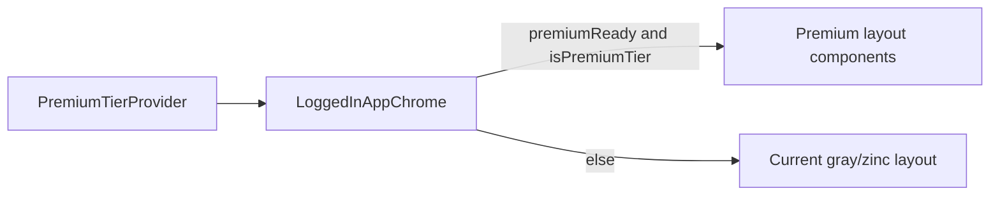

# Sprint 4.1: Obsidian & Gold (Premium-only Tailwind)

## Goal (from [PREMIUM_ARCHITECTURE_PLAN.md](PREMIUM_ARCHITECTURE_PLAN.md))

- Deliver the **Obsidian & Gold** look using Tailwind, with **no premium styles mounted or applied** unless the existing [`usePremiumTier()`](c:\Users\me\BaseCamp\src\context\PremiumTierContext.tsx) resolves to `isPremiumTier === true` (and typically `isReady === true` to avoid a flash of premium chrome during loading).
- Defer **LazyMotion** and **Workbox `globIgnores`** to Sprints 4.2 and 4.3; do not refactor `motion` imports in 4.1.

## Current integration points (already in place)

- [`PremiumTierProvider`](c:\Users\me\BaseCamp\src\context\PremiumTierContext.tsx) wraps staff [`LoggedInApp`](c:\Users\me\BaseCamp\src\App.tsx) only; [`LoggedInAppChrome`](c:\Users\me\BaseCamp\src\components\layout\LoggedInAppChrome.tsx) already calls `usePremiumTier()` for feature gating (e.g. live classroom).
- Styling is **Tailwind v4** via [`@import "tailwindcss"`](c:\Users\me\BaseCamp\src\index.css) and [`@theme { ... }`](c:\Users\me\BaseCamp\src\index.css) (no `tailwind.config.js`).

## Architecture: how to keep premium UI strictly gated

**Recommended pattern:** add **CSS design tokens** globally (so Tailwind can reference them), but only **apply** Obsidian & Gold *classes* inside branches or premium-only components when `premiumReady && isPremiumTier` is true. That avoids changing base `body` styles for GES users and matches “conditionally rendering … behind” the context.

**Scope note — [`StudentPortalApp`](c:\Users\me\BaseCamp\src\features\students\StudentPortalApp.tsx):** it is rendered from [`main.tsx`](c:\Users\me\BaseCamp\src\main.tsx) **outside** `PremiumTierProvider`, and portal users are not the same auth shape as staff, so `usePremiumTier()` is not available there without new wiring. For Sprint 4.1, **implement the premium shell in the staff app** (`LoggedInAppChrome` + `Header` + nav). If you want the same skin on `#/portal` in the same sprint, add an explicit follow-up: either a minimal provider for portal or a **separate** school-curriculum-only “visual theme” hook (cosmetic, not the same security gate as the token + school `resolveEffectivePremiumTier` in [`resolveEffectivePremiumTier.ts`](c:\Users\me\BaseCamp\src\utils\resolveEffectivePremiumTier.ts)).

## Files to create

| File | Purpose |
|------|---------|
| [`src/components/premium/premiumClassNames.ts`](src/components/premium/premiumClassNames.ts) (or `premiumTokens.ts`) | Central **string constants** for premium shells: page background, sidebar, header, main surface, text hierarchy, focus/accent (gold) — so [`LoggedInAppChrome`](c:\Users\me\BaseCamp\src\components\layout\LoggedInAppChrome.tsx) stays readable and duplicates no long class strings. |
| [`src/components/premium/PremiumHeaderChrome.tsx`](src/components/premium/PremiumHeaderChrome.tsx) | Premium-only top bar: Obsidian background, gold accent on brand lockup, adjusted offline/sync controls. **Render only** when `premiumReady && isPremiumTier`. |
| [`src/components/premium/PremiumSidebarChrome.tsx`](src/components/premium/PremiumSidebarChrome.tsx) + [`PremiumMobileNavChrome.tsx`](src/components/premium/PremiumMobileNavChrome.tsx) (or one component with `layout` prop) | Premium-only side nav / bottom glass pill using gold active state instead of indigo. |
| Optional: [`src/components/premium/PremiumWelcomeBanner.tsx`](src/components/premium/PremiumWelcomeBanner.tsx) | Premium-only H1 + subtitle block replacing the current [`DASHBOARD_CONFIG` header block](c:\Users\me\BaseCamp\src\components\layout\LoggedInAppChrome.tsx) (lines ~388–395) when premium. |

Adjust the split (one file vs. several) to match your preference; the important part is **exclusive premium components** or **exclusive class maps** with no gold/obsidian utilities on the default path.

## Files to modify

| File | Change |
|------|--------|
| [`src/index.css`](c:\Users\me\BaseCamp\src\index.css) | Under `@theme`, add **Obsidian + Gold** CSS variables, e.g. `--color-obsidian-950` … and `--color-gold-400/500` (names aligned with Tailwind v4 token usage). Optionally add `@layer utilities` for `.premium-surface` / `.premium-glass` **only if** you want reusable one-liners; keep base `body` rule **unchanged** for the default tier. |
| [`src/components/layout/LoggedInAppChrome.tsx`](c:\Users\me\BaseCamp\src\components\layout\LoggedInAppChrome.tsx) | At the root layout (currently `min-h-screen bg-gray-50` ~line 339), **branch** on `premiumReady && isPremiumTier`: mount premium `Header` + `aside` + `main` wrapper classes vs. existing markup. Reuse a single `renderContent()`; only the chrome around it changes. Keep [`AuthProvider`](c:\Users\me\BaseCamp\src\components\layout\LoggedInAppChrome.tsx) and [`AnimatePresence`/`motion.div`](c:\Users\me\BaseCamp\src\components\layout\LoggedInAppChrome.tsx) as-is (LazyMotion in 4.2). |
| [`src/components/layout/Header.tsx`](c:\Users\me\BaseCamp\src\components\layout\Header.tsx) | Either export a **minimal shared piece** (e.g. offline banner, logout) used by both, or **stop rendering** the default header for the premium branch and delegate to `PremiumHeaderChrome` from `LoggedInAppChrome` only. Avoid mixing Obsidian classes into the default header path. |
| [`src/components/layout/SidebarNavLink.tsx`](c:\Users\me\BaseCamp\src\components\layout\SidebarNavLink.tsx) | Add an optional `variant?: 'default' | 'premium'` (or `theme`) that swaps active/hover class strings, **or** use a premium-only `PremiumSidebarNavLink` in the new file — keep default `indigo` path unchanged for GES. |

**Files explicitly not in scope for 4.1** (per roadmap): [`vite.config.ts`](c:\Users\me\BaseCamp\vite.config.ts) PWA/Workbox (4.3); new `framer-motion` / LazyMotion refactors (4.2).

## Step-by-step execution order

1. **Tokens:** Add Obsidian + Gold variables to [`src/index.css`](c:\Users\me\BaseCamp\src\index.css) `@theme`; verify they appear in the build (e.g. `bg-obsidian-950` if mapped, or `bg-[var(--...)]` pattern you choose for v4).
2. **Class map / primitives:** Add [`premiumClassNames.ts`](src/components/premium/premiumClassNames.ts) with the full chrome strings and any shared sub-parts (sync toast, borders).
3. **Premium header:** Implement `PremiumHeaderChrome` using only premium tokens; no default tier regression.
4. **Premium nav:** Implement premium sidebar + mobile nav (mirror structure of current [`LoggedInAppChrome`](c:\Users\me\BaseCamp\src\components\layout\LoggedInAppChrome.tsx) + [`SidebarNavLink`](c:\Users\me\BaseCamp\src\components\layout\SidebarNavLink.tsx)).
5. **Integrate in `LoggedInAppChrome`:** `const premium = premiumReady && isPremiumTier;` then `premium ? <Premium.../> : <existing.../>` for shell only; keep content `renderContent()` shared.
6. **Polish:** Tune contrast (WCAG) for body text and gold on obsidian; ensure offline banner + queue badge remain visible.
7. **Manual test:** GES / non-premium user: UI identical to before. Premium user (claim + Cambridge school from [`resolveEffectivePremiumTier`](c:\Users\me\BaseCamp\src\utils\resolveEffectivePremiumTier.ts)): full Obsidian & Gold shell.

## Risks / guardrails

- **Flash of wrong theme:** Use `isReady` from context (same pattern as `showLiveClassroom`) before showing premium chrome.
- **Bundle:** Pure Tailwind + conditional components is fine; no new animation libs in 4.1.
- **Login / signup:** [`Login`](c:\Users\me\BaseCamp\src\components\Login) and [`HeadteacherSignUp`](c:\Users\me\BaseCamp\src\components\auth\HeadteacherSignUp.tsx) stay on the current light theme unless you explicitly expand scope.
