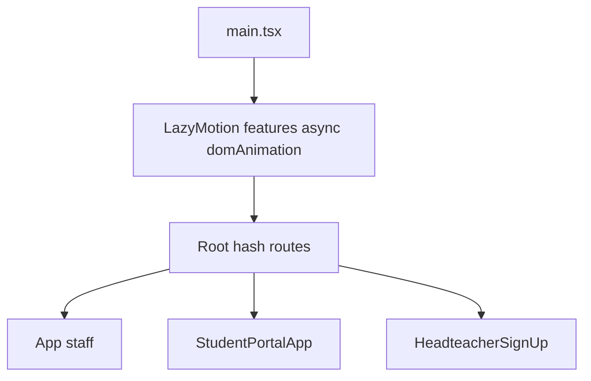

# Sprint 4.2: LazyMotion (`m` + dynamic `domAnimation`)

## Goal

- Replace synchronous **`motion.*`** usage with **`m.*`** and wrap the app in **`<LazyMotion features={asyncLoader}>`** so the heavy DOM animation bundle loads as a **separate chunk** (~reduced main-thread cost vs. full `motion` in the entry graph), matching the architecture doc’s intent (4.6kb-style “lite” path + deferred `domAnimation`).
- **Do not** change [vite.config.ts](c:\Users\me\BaseCamp\vite.config.ts) PWA `globIgnores` in this sprint—that is **Sprint 4.3**.

## Current state (audit)

| File | Imports / usage |
|------|-----------------|
| [src/main.tsx](c:\Users\me\BaseCamp\src\main.tsx) | No `LazyMotion` yet; switches `App` / `StudentPortalApp` / `HeadteacherSignUp` |
| [src/components/layout/LoggedInAppChrome.tsx](c:\Users\me\BaseCamp\src\components\layout\LoggedInAppChrome.tsx) | `AnimatePresence`, `motion` |
| [src/components/Login.tsx](c:\Users\me\BaseCamp\src\components\Login.tsx) | `AnimatePresence`, `motion` |
| [src/components/ui/button.tsx](c:\Users\me\BaseCamp\src\components\ui\button.tsx) | `motion`, `HTMLMotionProps` → `motion.button` with `whileTap` |
| [src/features/assessments/WorksheetPremiumFigure.tsx](c:\Users\me\BaseCamp\src\features\assessments\WorksheetPremiumFigure.tsx) | `motion` for SVG elements |

No other `motion/react` imports were found in `src/`. Dependency: [package.json](c:\Users\me\BaseCamp\package.json) lists `"motion": "^12.x"` (Framer Motion’s modern package name).

## Recommended architecture

- **Single `LazyMotion` at the top** in [main.tsx](c:\Users\me\BaseCamp\src\main.tsx) **wrapping `<Root />`** (inside or outside `StrictMode`, both work; typical: `StrictMode` → `LazyMotion` → `Root`). This ensures [Button](c:\Users\me\BaseCamp\src\components\ui\button.tsx) and any screen using `m` are always under `LazyMotion`, including `#/portal` and `#/headteacher-signup` without duplicating wrappers.
- **`features` loader:** use the pattern from the architecture doc, adapted to this repo’s package:
  - `features={() => import('motion/react').then((mod) => mod.domAnimation)}`  
  **Verify** at implementation time that `domAnimation` is exported from `motion/react` in the installed version (if the export name differs, use the package’s documented lite feature export—same idea).
- **`strict`:** enable **`<LazyMotion strict>`** so any accidental `motion.*` usage inside the tree fails in dev and catches regressions.

## Files to modify (exact)

1. **[src/main.tsx](c:\Users\me\BaseCamp\src\main.tsx)**  
   - Import `LazyMotion` from `motion/react`.  
   - Wrap `<Root />` with `LazyMotion` + async `features` as above + `strict`.  
   - Keep `registerLiveClassroomRtdbBypass()` and CSS import order unchanged.

2. **[src/components/ui/button.tsx](c:\Users\me\BaseCamp\src\components\ui\button.tsx)**  
   - Switch `motion` → **`m`**.  
   - Replace `motion.button` with **`m.button`**.  
   - Keep `HTMLMotionProps` if types still align with `m.button` (adjust import if the package exposes a dedicated type for `m`; often the same `HTMLMotionProps<'button'>` applies).

3. **[src/components/layout/LoggedInAppChrome.tsx](c:\Users\me\BaseCamp\src\components\layout\LoggedInAppChrome.tsx)**  
   - Import `AnimatePresence` and **`m`** from `motion/react` (not `motion`).  
   - Replace `motion.div` with **`m.div`** where used.

4. **[src/components/Login.tsx](c:\Users\me\BaseCamp\src\components\Login.tsx)**  
   - Same: `AnimatePresence` + **`m`**, replace `motion.*` with `m.*`.

5. **[src/features/assessments/WorksheetPremiumFigure.tsx](c:\Users\me\BaseCamp\src\features\assessments\WorksheetPremiumFigure.tsx)**  
   - Replace `motion` with **`m`** for animated nodes (e.g. `m.g`, `m.circle` as used in file).

## Files to create

- **None required** if the root wrapper is sufficient.  
- **Optional (only if you want shared typing):** e.g. `src/motion/lazyMotionFeatures.ts` exporting the single `() => import('motion/react').then(...)` function for reuse and unit clarity—small and optional.

## Verification steps (after implementation)

- Run `npm run build` and confirm **no** `motion` (full) component path remains in source for animated primitives—only `m` + `LazyMotion` + `AnimatePresence`.  
- Smoke-test: staff login view transitions, main chrome view changes, and a worksheet with premium figure if available.  
- **Chunk naming:** note Rollup’s emitted names for the async `domAnimation` chunk; Sprint 4.3 will align `globIgnores` (e.g. `**/assets/motion-*.js`) with actual filenames.

## Out of scope (explicit)

- [vite.config.ts](c:\Users\me\BaseCamp\vite.config.ts) Workbox `globIgnores` / PWA — **Sprint 4.3**  
- Replacing or adding animations in new components beyond the `motion` → `m` migration  
- `ffmpeg`/video chunk naming (also 4.3)
