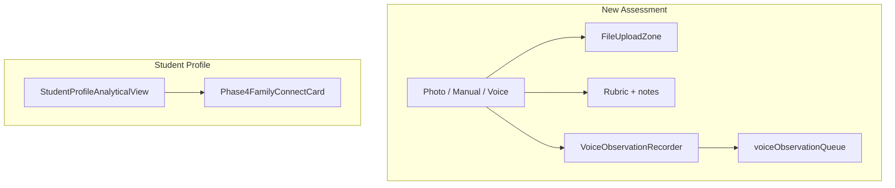

# Teacher tabs, voice on New Assessment, slim Student Profile

## 1. Tab order (teacher)

In `[src/App.tsx](src/App.tsx)`, swap the two `NavTab` entries so **Student Profiles** appears **before** **Pending Analyses** (lines ~450–452).

## 2. Voice observation as third input mode (New Assessment)

**Types:** Extend `[AssessmentData](src/components/AssessmentSetup.tsx)` so `inputMode` is `'upload' | 'manual' | 'voice'`.

**UI in `[src/components/AssessmentSetup.tsx](src/components/AssessmentSetup.tsx)`:**

- Change the input-mode control from a 2-column grid to **three** options: Photo Upload, Manual Entry, **Voice observation** (e.g. `Mic` icon from `lucide-react`).
- When `inputMode === 'voice'`:
  - Render `[VoiceObservationRecorder](src/components/VoiceObservationRecorder.tsx)` (same behavior as today: record → queue → sync when online).
  - **Do not** show the primary **Run AI Diagnosis** submit button (voice saves on stop via the existing queue). Add short helper copy explaining that finishing a recording queues it for analysis/sync.
- When `inputMode !== 'voice'`, keep current upload/manual blocks and submit behavior unchanged.
- **Props:** Add optional `processVoiceObservationQueue?: () => Promise<void>` to `AssessmentSetupProps`. Pass it into `VoiceObservationRecorder`’s `onQueued` (call `processVoiceObservationQueue?.()` after a successful queue, mirroring the old `[StudentProfile](src/components/StudentProfile.tsx)` callback).

**App wiring in `[src/App.tsx](src/App.tsx)`:**

- Pass `processVoiceObservationQueue={processVoiceQueue}` into `AssessmentSetup` (same `processVoiceQueue` from `useVoiceObservationSync`).
- `**handleDiagnose`:** No new branch is required if voice mode never submits the diagnosis form; optionally guard with `if (data.inputMode === 'voice') return` if anything ever calls `onDiagnose` with voice. Voice continues to use `[voiceObservationQueueService](src/services/voiceObservationQueueService.ts)` independently of the diagnosis offline queue.

**Right panel copy (optional polish):** Pass `inputMode` (or a boolean `isVoiceMode`) from `lastAssessmentData` into `[AnalysisResults](src/components/AnalysisResults.tsx)` so the empty state can say something like “Use the left panel to record a voice observation” when the teacher is in voice mode, instead of only mentioning upload/manual.

## 3. Remove voice + Action Plan from Student Profile

`**[src/components/StudentProfile.tsx](src/components/StudentProfile.tsx)`:**

- Remove `VoiceObservationRecorder`, synced voice list, `getVoiceObservationsForStudent` usage, and the `processVoiceObservationQueue` prop.
- Remove the **Data View / Action Plan** toggle, `[StudentProfileActionPlanView](src/components/StudentProfileActionPlanView.tsx)`, `[WorksheetModal](src/components/WorksheetModal.tsx)`, and all handlers/state only used there: `viewMode`, `regeneratingAssessmentId`, `generatingSheetFor`, `activeWorksheet`, `lastWorksheetByCard`, `handleRegenerateLessonPlan`, `handleGeneratePracticeSheet`, `handlePrintWorksheet`, and related imports (`generateRemedialLessonPlan`, `generatePracticeWorksheet`, `updateAssessment`, `printLessonPlanWindow`, `printWorksheetToWindow`, etc.).
- Keep **Export PDF**, student selector, header, and a **single** main content: `[StudentProfileAnalyticalView](src/components/StudentProfileAnalyticalView.tsx)` only.

`**[src/App.tsx](src/App.tsx)`:** Stop passing `processVoiceObservationQueue` into `StudentProfile`.

`**[src/hooks/useStudentProfileData.tsx](src/hooks/useStudentProfileData.tsx)`:** Remove voice observation fetching and `voiceObservations` / `setVoiceObservations` from the hook API (nothing else references them per codebase search). Optionally stop exporting `gapInterventions` if only the removed Action Plan used it (same file: trim dead computation if unused).

**Note:** Lesson plans / worksheets remain available on the **post-diagnosis** flow (`[DiagnosticReportCard](src/components/DiagnosticReportCard.tsx)` / `[AnalysisResults](src/components/AnalysisResults.tsx)`); only the **profile** copy of that workflow is removed.

## 4. Phase 4 card placement

**Recommendation:** Render `[Phase4FamilyConnectCard](src/components/Phase4FamilyConnectCard.tsx)` **once**, for `userRole === 'teacher'` with a selected student, **after** the analytical content that already includes longitudinal history, JHS readiness, neurodevelopment/SEN, mastered concepts, and gaps.

Concretely: remove the standalone Phase 4 block from its current position (above the old toggle / above the main grid). Re-insert it **below** `<StudentProfileAnalyticalView ... />` so the narrative order is: profile chrome → **data** (history → readiness → SEN → mastery/gaps) → **family / Phase 4 engagement**.

If you prefer it “higher” in the scroll, the only other strong option is immediately **after** the Neurodevelopment & SEN card inside `[StudentProfileAnalyticalView.tsx](src/components/StudentProfileAnalyticalView.tsx)`; the bottom placement avoids splitting the two-column mastery/gaps row and reads as “next steps after understanding the learner.”

## 5. Scope check vs requested profile content

`[StudentProfileAnalyticalView](src/components/StudentProfileAnalyticalView.tsx)` already maps to your list:

| Requested                | Where                                                                                         |
| ------------------------ | --------------------------------------------------------------------------------------------- |
| Longitudinal history     | Left column “Longitudinal Performance History”                                                |
| JHS readiness score      | “JHS Readiness Score” (real data) / baseline “Predictive JHS 1 Readiness” when no assessments |
| Neurodevelopment & SEN   | “Neurodevelopmental & SEN Risk Screening”                                                     |
| Mastered concepts / gaps | Bottom two cards                                                                              |

No structural change required beyond removing non-analytical UI from the parent.

## Files to touch (summary)

- `[src/App.tsx](src/App.tsx)` — tab order; `AssessmentSetup` props; remove voice prop from `StudentProfile`; optional `handleDiagnose` guard.
- `[src/components/AssessmentSetup.tsx](src/components/AssessmentSetup.tsx)` — `AssessmentData`, third mode, voice UI, conditional submit.
- `[src/components/StudentProfile.tsx](src/components/StudentProfile.tsx)` — large deletion + Phase 4 move.
- `[src/hooks/useStudentProfileData.tsx](src/hooks/useStudentProfileData.tsx)` — drop voice (and unused gap data if applicable).
- `[src/components/AnalysisResults.tsx](src/components/AnalysisResults.tsx)` — optional empty-state tweak when in voice mode.

**Optional cleanup:** If `StudentProfileActionPlanView.tsx` becomes unused, delete the file or leave it with a short comment for a future “Interventions” tab—your call during implementation.