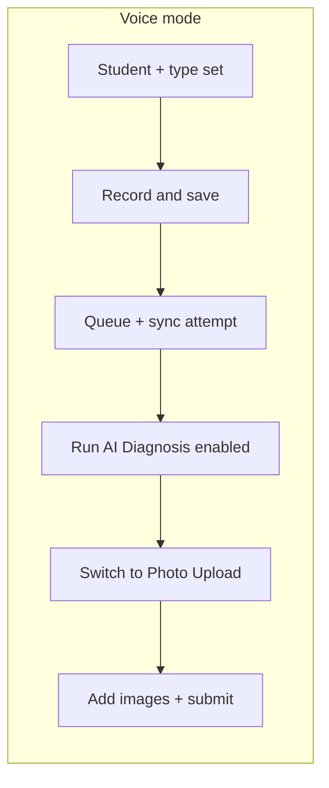

# Voice mode: record gating and Run AI Diagnosis after save

## Problem

- In `[AssessmentSetup.tsx](src/components/AssessmentSetup.tsx)`, voice mode always shows a **disabled** grey `Run AI Diagnosis` (`type="button"`), so it never becomes the real workflow CTA after a clip is saved.
- **Record note** uses `canRecordVoice = !!selectedStudent` only; you want **student + assessment type** before recording.
- You want the voice clip **written to the queue (and sync attempted)** before the diagnosis CTA is available.

## Approach

### 1. Recording prerequisites

- Set `canRecordVoice = isFormValid` where `isFormValid` is already `!!selectedStudent && !!assessmentType`.
- Pass `disabled={!canRecordVoice}` into `[VoiceObservationRecorder](src/components/VoiceObservationRecorder.tsx)`.
- When `!isFormValid`, show the amber hint (update copy to mention **both** student and assessment type). Only render the recorder when `isFormValid` (same as before structurally, but aligned with both fields).

### 2. Track “voice clip saved successfully”

- Add React state in `AssessmentSetup`, e.g. `voiceClipSaved`, default `false`.
- Set `voiceClipSaved` to `true` only in the recorder’s `onQueued` callback **after**:
  - `addVoiceObservationToQueue` has already succeeded (that happens inside the recorder before `onQueued` runs), and  
  - `await processVoiceObservationQueue?.()` completes in the parent (existing pattern).
- Wrap the parent `onQueued` body in try/catch: if sync fails, still set `voiceClipSaved = true` when local queue write succeeded (queue already committed before `onQueued`); optionally `console.error` or a small non-blocking message so teachers are not blocked offline.
- **Reset** `voiceClipSaved` when any of these change: `selectedStudent`, `assessmentType`, or `inputMode` (so returning to Voice or changing context requires a new saved clip before the CTA unlocks again).

### 3. Run AI Diagnosis footer in voice mode

Replace the always-disabled fake button with conditional UI:

- **Before** `voiceClipSaved`: keep a **disabled** full-width control styled like the primary button (or match current grey style) with short copy: e.g. “Save your voice recording first” / “Run AI Diagnosis unlocks after your note is saved.”
- **After** `voiceClipSaved`: show an **enabled** full-width `type="button"` (not submit) labeled **Run AI Diagnosis** that:
  - Calls `setInputMode('upload')` (and optionally resets `voiceClipSaved` to `false` or leaves it—prefer reset when leaving voice so the flow is clear).
  - Shows a one-line helper under the button: e.g. “Upload worksheet photos below, then tap Run AI Diagnosis again to analyze.”

After switching to **Photo Upload**, the existing **submit** `Run AI Diagnosis` path runs `onDiagnose` with images as today—no change to `[App.tsx](src/App.tsx)` `handleDiagnose` voice guard unless you later want a different transition.

### 4. Optional small robustness in recorder

If `onQueued` throws after `addVoiceObservationToQueue` succeeds, the recorder currently falls into the generic catch. Optional follow-up: wrap `await onQueued?.()` in its own try/catch so encoding ends cleanly and a specific sync error can be shown; **not required** for the minimal plan if parent `onQueued` does not throw.

## Files to touch

| File                                                                                         | Change                                                                                                                 |
| -------------------------------------------------------------------------------------------- | ---------------------------------------------------------------------------------------------------------------------- |
| `[src/components/AssessmentSetup.tsx](src/components/AssessmentSetup.tsx)`                   | `canRecordVoice`, `voiceClipSaved` + reset effect, `onQueued` handler, voice footer conditional + transition to upload |
| `[src/components/VoiceObservationRecorder.tsx](src/components/VoiceObservationRecorder.tsx)` | Optional: isolate `onQueued` errors (only if needed after testing)                                                     |

## UX summary

