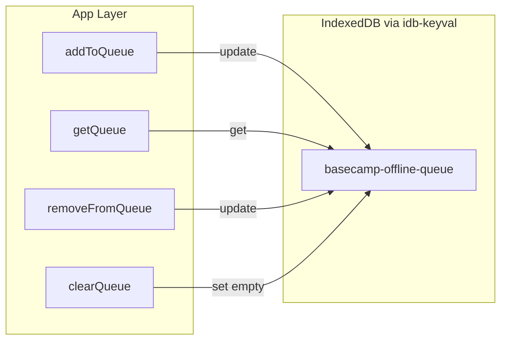

# Offline queue service (IndexedDB)

> **Note:** This document reflects the **initial** plan. The live [`src/services/offlineQueueService.ts`](../../src/services/offlineQueueService.ts) schema was later extended for multi-page uploads and manual entry (see [Offline diagnosis queue](offline-diagnosis-queue.md)).

## Summary

Add `idb-keyval` and create `src/services/offlineQueueService.ts` with a `QueuedAssessment` interface and queue management functions. Wrap operations in `try/catch` with `console.error` so IndexedDB restrictions (private browsing, quota) do not crash the app.

## 1. Dependency

Add `idb-keyval` to `package.json` and run `npm install`.

## 2. Service API

**Store key:** `basecamp-offline-queue`

**Functions:**

- `addToQueue(item)` — append with generated `id` and `timestamp` (use `update()` for atomic append).
- `getQueue()` — return array or `[]`.
- `removeFromQueue(id)` — filter out by id.
- `clearQueue()` — set empty array.

Use `get`, `set`, `update` from `idb-keyval`; `update` avoids race conditions when multiple operations run.

## 3. Data flow

## 4. Integration

- Call `addToQueue` when submitting work offline.
- Use `getQueue` to show pending items and on reconnect.
- Call `removeFromQueue` after successful sync.

## Source

Derived from `.cursor/plans/offline_queue_service_*.plan.md`.
